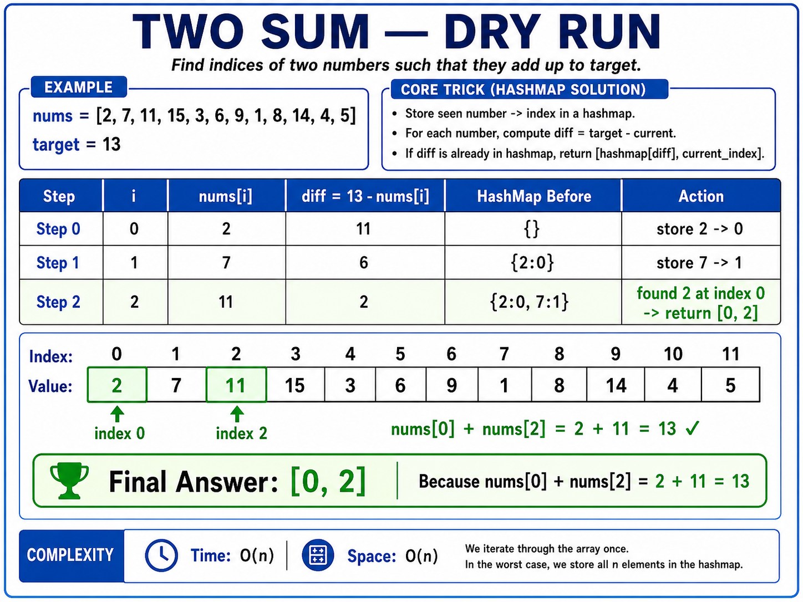
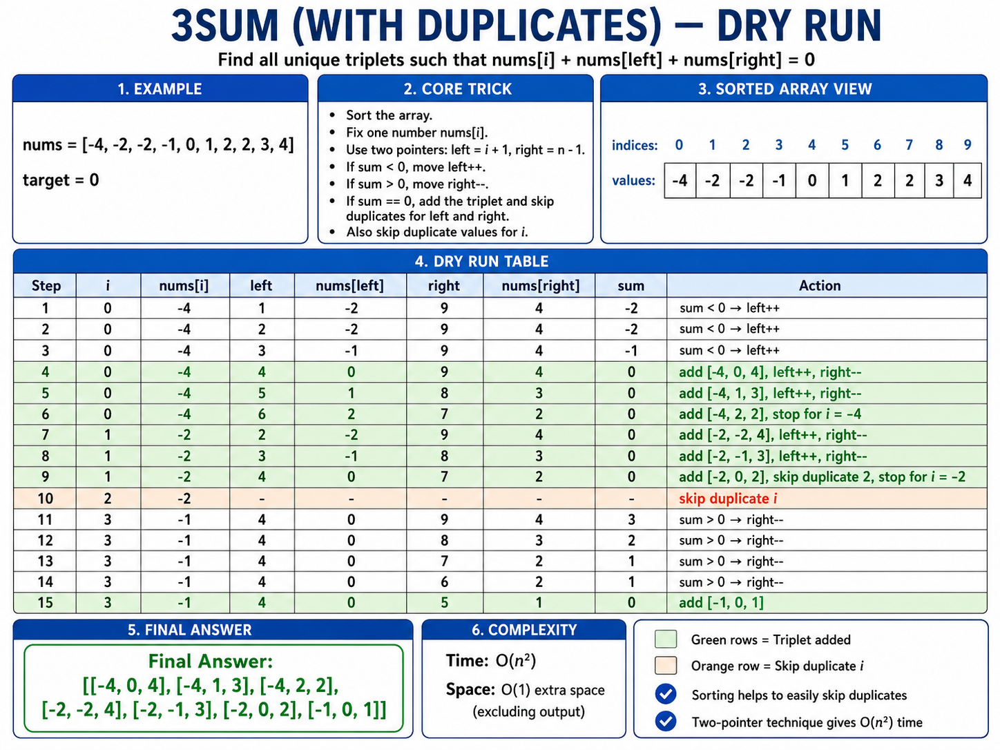
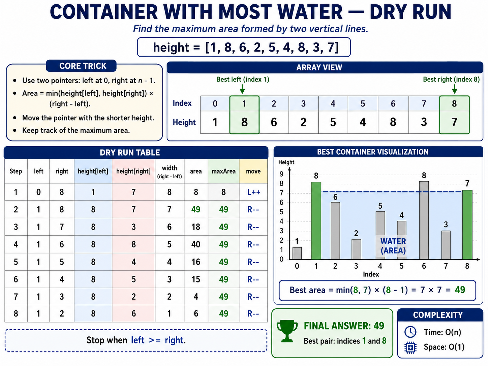
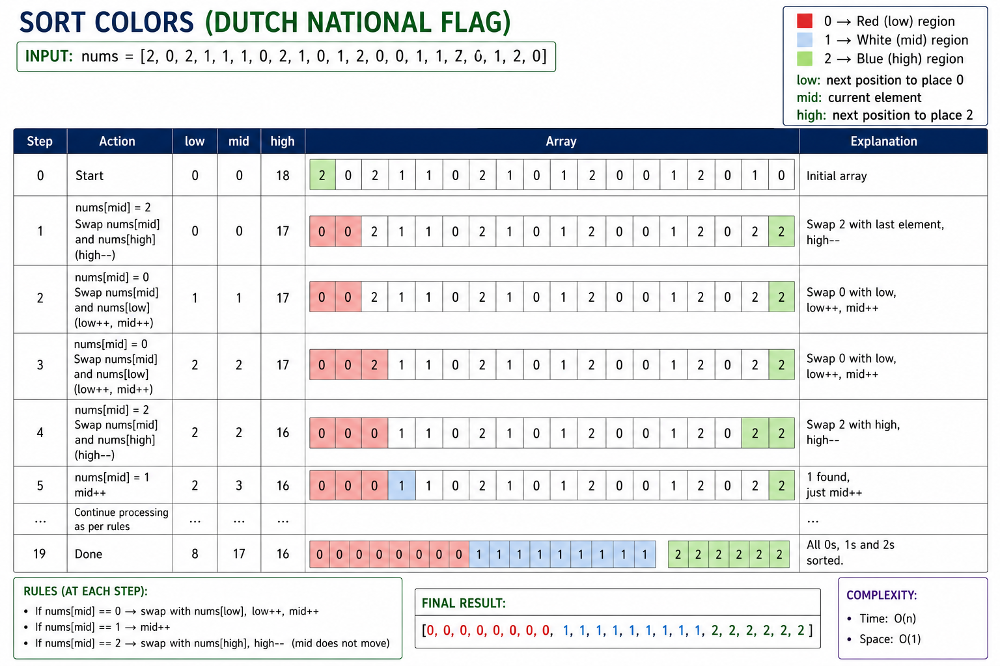

## 1. Two Sum



```python
from typing import List


class Solution:
    def twoSum(self, nums: List[int], target: int) -> List[int]:
        # Trick: Check for the required difference before storing current.
        hashmap = {}

        for i, num in enumerate(nums):
            diff = target - num

            if diff in hashmap:
                return [hashmap[diff], i]

            hashmap[num] = i

        return []
```

- Time: `O(n)`
- Space: `O(n)`

---

## 2. 3Sum With Duplicates

**Code Trick:** Sort the array, fix one number, and use two pointers for the other two numbers. Skip duplicate values for `i`, `left`, and `right`.



```python
from typing import List


class Solution:
    def threeSum(self, nums: List[int]) -> List[List[int]]:
        # Trick: Sort + fix one number + two pointers + skip duplicates.
        nums.sort()
        result = []

        for i in range(len(nums) - 2):
            if i > 0 and nums[i] == nums[i - 1]:
                continue

            if nums[i] > 0:
                break

            left = i + 1
            right = len(nums) - 1

            while left < right:
                total = nums[i] + nums[left] + nums[right]

                if total < 0:
                    left += 1

                elif total > 0:
                    right -= 1

                else:
                    result.append([nums[i], nums[left], nums[right]])
                    left += 1
                    right -= 1

                    while left < right and nums[left] == nums[left - 1]:
                        left += 1

                    while left < right and nums[right] == nums[right + 1]:
                        right -= 1

        return result
```

- Time: `O(n²)`
- Space: `O(1)` extra space, excluding the output and sorting implementation

---

## 3. Container With Most Water

**Code Trick:** Start with pointers at both ends. Calculate the area, then move the pointer at the shorter line because the shorter line limits the container height.



```python
from typing import List


class Solution:
    def maxArea(self, height: List[int]) -> int:
        # Trick: Move the shorter wall inward.
        left = 0
        right = len(height) - 1
        max_area = 0

        while left < right:
            width = right - left
            current_height = min(height[left], height[right])
            area = width * current_height

            max_area = max(max_area, area)

            if height[left] < height[right]:
                left += 1
            else:
                right -= 1

        return max_area
```

- Time: `O(n)`
- Space: `O(1)`

---

## 4. Sort Colors — Sort 0, 1, and 2

**Code Trick:** Use the Dutch National Flag algorithm with three pointers: `low`, `mid`, and `high`.



```python
from typing import List


class Solution:
    def sortColors(self, nums: List[int]) -> None:
        # Trick:
        # 0 -> swap with low, move low and mid
        # 1 -> move mid
        # 2 -> swap with high, move only high
        low = 0
        mid = 0
        high = len(nums) - 1

        while mid <= high:
            if nums[mid] == 0:
                nums[low], nums[mid] = nums[mid], nums[low]
                low += 1
                mid += 1

            elif nums[mid] == 1:
                mid += 1

            else:
                nums[mid], nums[high] = nums[high], nums[mid]
                high -= 1
```

- Time: `O(n)`
- Space: `O(1)`

---

## 5. Product of Array Except Self

**Code Trick:** Store the product of all elements to the left of each index during the prefix pass, then multiply it by the product of all elements to the right during the suffix pass.


```python
from typing import List


class Solution:
    def productExceptSelf(self, nums: List[int]) -> List[int]:
        # Trick: Prefix product first, then multiply by suffix product.
        answer = [1] * len(nums)

        prefix = 1

        for i in range(len(nums)):
            answer[i] = prefix
            prefix *= nums[i]

        suffix = 1

        for i in range(len(nums) - 1, -1, -1):
            answer[i] *= suffix
            suffix *= nums[i]

        return answer
```

- Time: `O(n)`
- Space: `O(1)` extra space, excluding the output array
