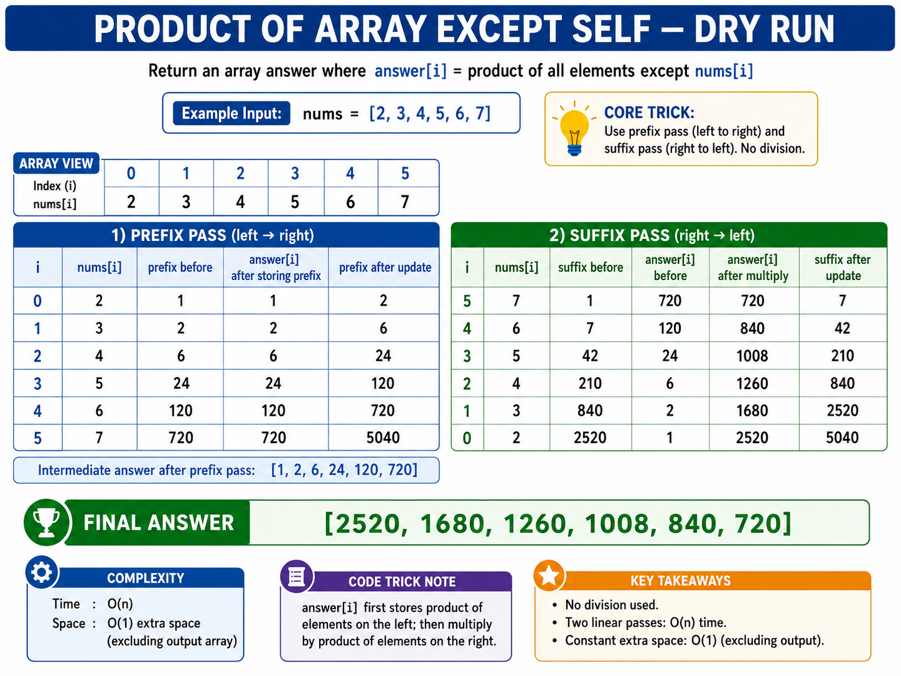
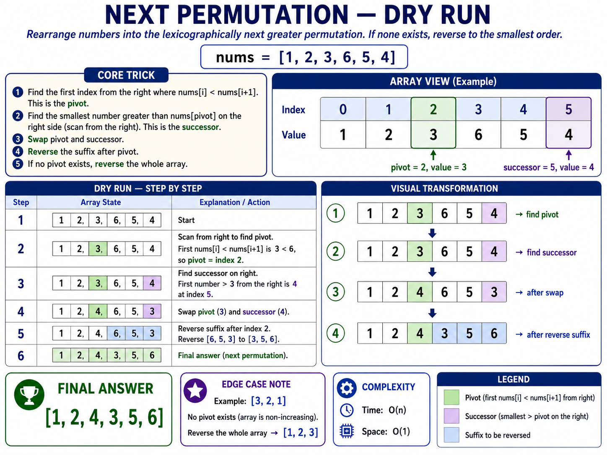
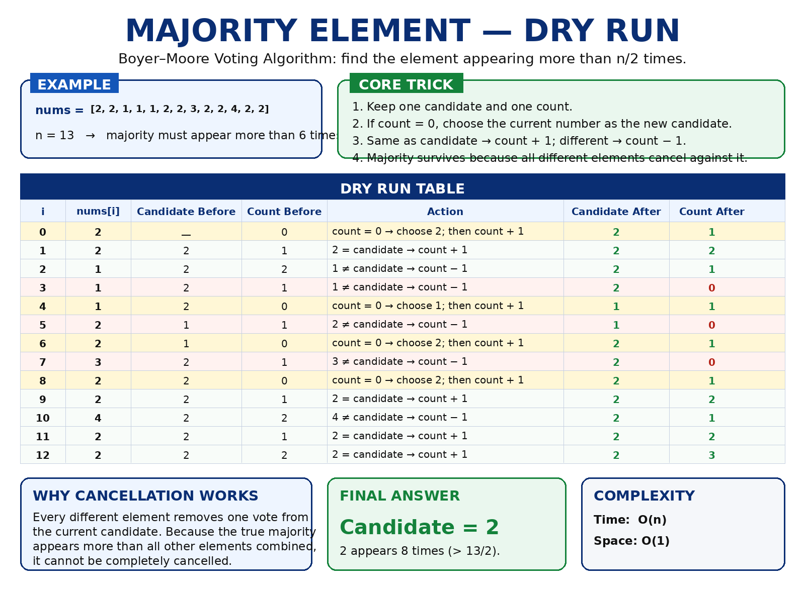
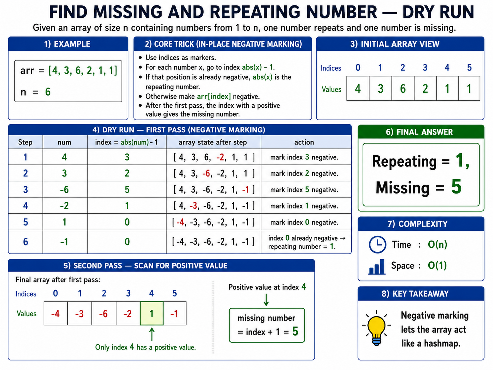
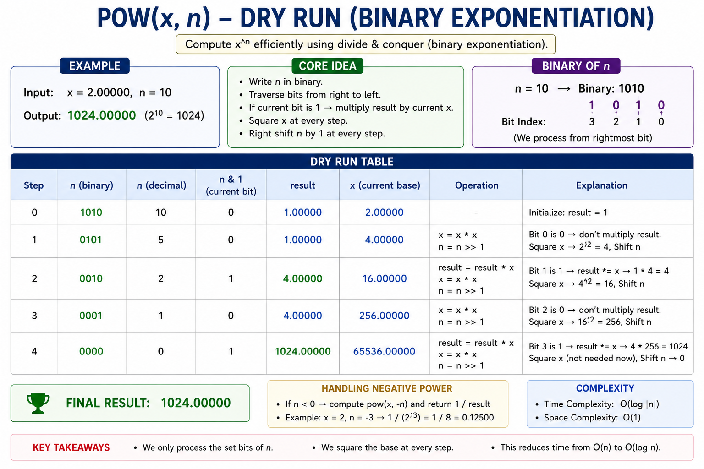
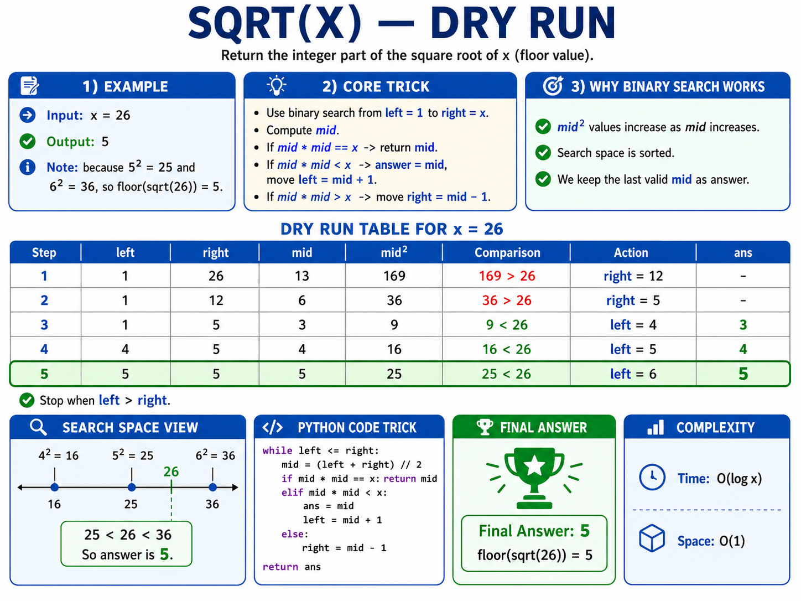
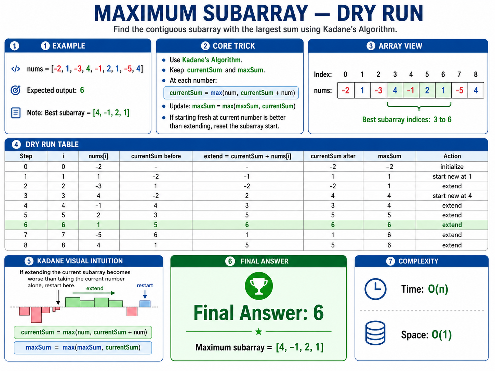

# Array and Math Problems — Python Notes

---

## 1. Two Sum

[LeetCode 1](https://leetcode.com/problems/two-sum/)


```python
class Solution:
    def twoSum(self, nums: list[int], target: int) -> list[int]:
        hashmap = {}

        for i, num in enumerate(nums):
            diff = target - num

            if diff in hashmap:
                return [hashmap[diff], i]

            hashmap[num] = i

        return []
```

**Time:** `O(n)`  
**Space:** `O(n)`

---

## 2. 3Sum

[LeetCode 15](https://leetcode.com/problems/3sum/)


```python
class Solution:
    def threeSum(self, nums: list[int]) -> list[list[int]]:
        nums.sort()
        result = []

        for i in range(len(nums) - 2):
            if nums[i] > 0:
                break

            if i > 0 and nums[i] == nums[i - 1]:
                continue

            left = i + 1
            right = len(nums) - 1

            while left < right:
                total = nums[i] + nums[left] + nums[right]

                if total == 0:
                    result.append([nums[i], nums[left], nums[right]])
                    left += 1
                    right -= 1

                    while left < right and nums[left] == nums[left - 1]:
                        left += 1

                    while left < right and nums[right] == nums[right + 1]:
                        right -= 1

                elif total < 0:
                    left += 1
                else:
                    right -= 1

        return result
```

**Time:** `O(n²)`  
**Space:** `O(1)` excluding the output and sorting space

---

## 3. Container With Most Water

[LeetCode 11](https://leetcode.com/problems/container-with-most-water/)


```python
class Solution:
    def maxArea(self, height: list[int]) -> int:
        left = 0
        right = len(height) - 1
        max_area = 0

        while left < right:
            width = right - left
            current_area = min(height[left], height[right]) * width
            max_area = max(max_area, current_area)

            if height[left] < height[right]:
                left += 1
            else:
                right -= 1

        return max_area
```

**Time:** `O(n)`  
**Space:** `O(1)`

---

## 4. Sort Colors

[LeetCode 75](https://leetcode.com/problems/sort-colors/)


```python
class Solution:
    def sortColors(self, nums: list[int]) -> None:
        low = 0
        mid = 0
        high = len(nums) - 1

        while mid <= high:
            if nums[mid] == 0:
                nums[low], nums[mid] = nums[mid], nums[low]
                low += 1
                mid += 1

            elif nums[mid] == 1:
                mid += 1

            else:
                nums[mid], nums[high] = nums[high], nums[mid]
                high -= 1
```

**Time:** `O(n)`  
**Space:** `O(1)`

---

## 5. Product of Array Except Self

[LeetCode 238](https://leetcode.com/problems/product-of-array-except-self/)



```python
class Solution:
    def productExceptSelf(self, nums: list[int]) -> list[int]:
        answer = [1] * len(nums)

        prefix = 1
        for i in range(len(nums)):
            answer[i] = prefix
            prefix *= nums[i]

        suffix = 1
        for i in range(len(nums) - 1, -1, -1):
            answer[i] *= suffix
            suffix *= nums[i]

        return answer
```

**Time:** `O(n)`  
**Space:** `O(1)` excluding the output array

---

## 6. Next Permutation

[LeetCode 31](https://leetcode.com/problems/next-permutation/)



```python
class Solution:
    def nextPermutation(self, nums: list[int]) -> None:
        pivot = len(nums) - 2

        while pivot >= 0 and nums[pivot] >= nums[pivot + 1]:
            pivot -= 1

        if pivot >= 0:
            successor = len(nums) - 1

            while nums[successor] <= nums[pivot]:
                successor -= 1

            nums[pivot], nums[successor] = nums[successor], nums[pivot]

        left = pivot + 1
        right = len(nums) - 1

        while left < right:
            nums[left], nums[right] = nums[right], nums[left]
            left += 1
            right -= 1
```

**Time:** `O(n)`  
**Space:** `O(1)`

---

## 7. Majority Element

[LeetCode 169](https://leetcode.com/problems/majority-element/)



```python
class Solution:
    def majorityElement(self, nums: list[int]) -> int:
        candidate = 0
        count = 0

        for num in nums:
            if count == 0:
                candidate = num

            if num == candidate:
                count += 1
            else:
                count -= 1

        return candidate
```

**Time:** `O(n)`  
**Space:** `O(1)`

---

## 8. Find Missing and Repeating Number



```python
class Solution:
    def findMissingRepeating(self, nums: list[int]) -> list[int]:
        repeating = -1
        missing = -1

        for num in nums:
            index = abs(num) - 1

            if nums[index] < 0:
                repeating = abs(num)
            else:
                nums[index] *= -1

        for i in range(len(nums)):
            if nums[i] > 0:
                missing = i + 1
                break

        return [repeating, missing]
```

**Time:** `O(n)`  
**Space:** `O(1)`

> This solution modifies the input array.

---

## 9. Pow(x, n)

[LeetCode 50](https://leetcode.com/problems/powx-n/)



```python
class Solution:
    def myPow(self, x: float, n: int) -> float:
        if n < 0:
            x = 1 / x
            n = -n

        result = 1.0

        while n > 0:
            if n % 2 == 1:
                result *= x

            x *= x
            n //= 2

        return result
```

**Time:** `O(log |n|)`  
**Space:** `O(1)`

---

## 10. Sqrt(x)

[LeetCode 69](https://leetcode.com/problems/sqrtx/)



```python
class Solution:
    def mySqrt(self, x: int) -> int:
        if x < 2:
            return x

        left = 1
        right = x
        answer = 0

        while left <= right:
            mid = (left + right) // 2
            square = mid * mid

            if square == x:
                return mid

            if square < x:
                answer = mid
                left = mid + 1
            else:
                right = mid - 1

        return answer
```

**Time:** `O(log x)`  
**Space:** `O(1)`

---

## 11. Maximum Subarray

[LeetCode 53](https://leetcode.com/problems/maximum-subarray/)



```python
class Solution:
    def maxSubArray(self, nums: list[int]) -> int:
        current_sum = nums[0]
        max_sum = nums[0]

        for i in range(1, len(nums)):
            current_sum = max(nums[i], current_sum + nums[i])
            max_sum = max(max_sum, current_sum)

        return max_sum
```

**Time:** `O(n)`  
**Space:** `O(1)`
