# Linked List — Must-Do Problems

---

## 1. Reverse a Linked List — Iterative and Recursive

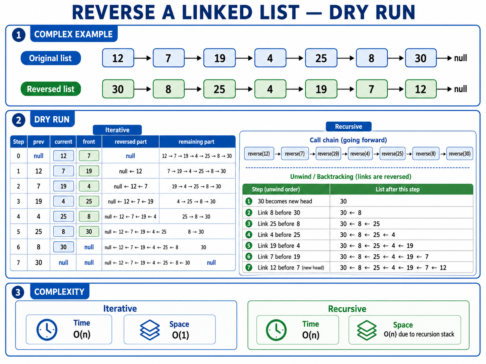

### Iterative

```python
class Solution:
    def reverseList(self, head):
        prev = None
        temp = head

        while temp is not None:
            front = temp.next
            temp.next = prev
            prev = temp
            temp = front
        return prev
```

### Recursive

```python
class Solution:
    def reverseList(self, head):
        # Step 1: Handle an empty list or a list with one node.
        if head is None or head.next is None:
            return head

        new_head = self.reverseList(head.next)
        head.next.next = head
        head.next = None

        return new_head
```

- Iterative: Time `O(n)`, Space `O(1)`
- Recursive: Time `O(n)`, Space `O(n)`

---

## 2. Loop Detection, Starting Point, and Loop Length

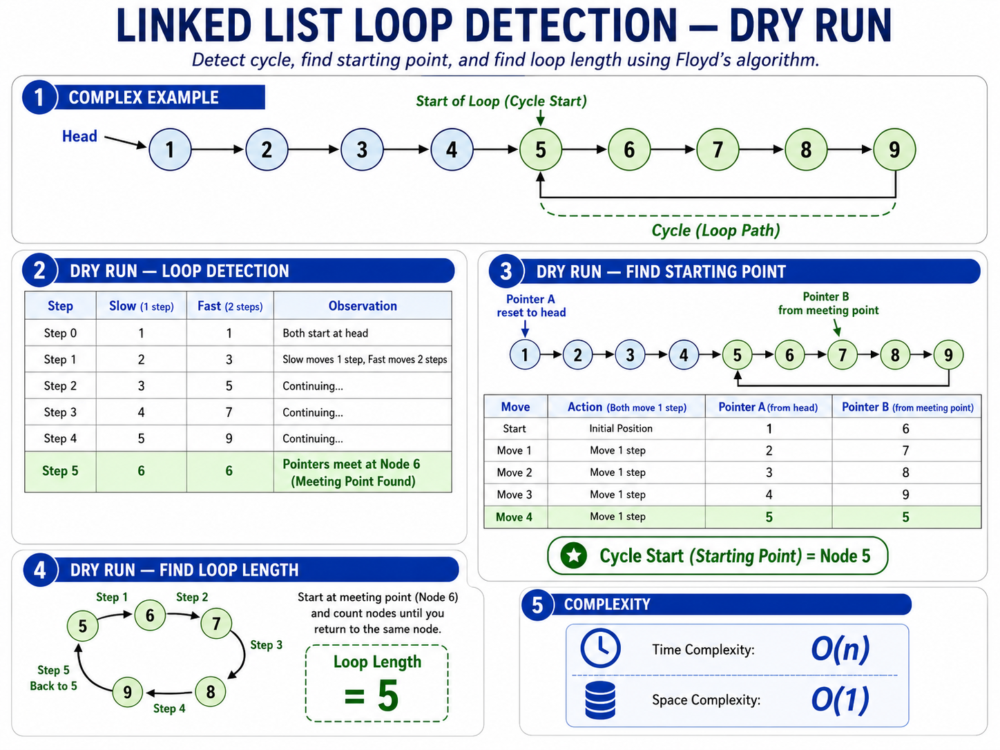

```python
class Solution:
    def getMeetingPoint(self, head):
        # Step 1: Start slow and fast pointers at the head.
        slow = fast = head

        # Step 2: Move slow by one step and fast by two steps.
        while fast and fast.next:
            slow = slow.next
            fast = fast.next.next

            # Step 3: If both pointers meet, a loop exists.
            if slow == fast:
                return slow

        # Step 4: Fast reached the end, so no loop exists.
        return None

    def hasCycle(self, head):
        # Step 1: A cycle exists when Floyd's pointers find a meeting point.
        return self.getMeetingPoint(head) is not None

    def detectCycle(self, head):
        # Step 1: Find a meeting point inside the loop.
        meeting = self.getMeetingPoint(head)

        # Step 2: If no meeting point exists, the list has no cycle.
        if meeting is None:
            return None

        # Step 3: Start another pointer from the head.
        temp = head

        # Step 4: Move both pointers one step at a time. They meet at the starting node of the loop.
        while temp != meeting:
            temp = temp.next
            meeting = meeting.next

        # Step 5: Return the loop starting point.
        return temp

    def cycleLength(self, head):
        # Step 1: Find a meeting point inside the loop.
        meeting = self.getMeetingPoint(head)

        # Step 2: If there is no cycle, its length is zero.
        if meeting is None:
            return 0

        # Step 3: Start counting from the node after the meeting point.
        count = 1
        temp = meeting.next

        # Step 4: Traverse the cycle until reaching the meeting point again.
        while temp != meeting:
            count += 1
            temp = temp.next

        # Step 5: Return the total number of nodes in the cycle.
        return count
```

- Time: `O(n)`
- Space: `O(1)`

---

## 3. Add Two Numbers

[LeetCode 2](https://leetcode.com/problems/add-two-numbers/)

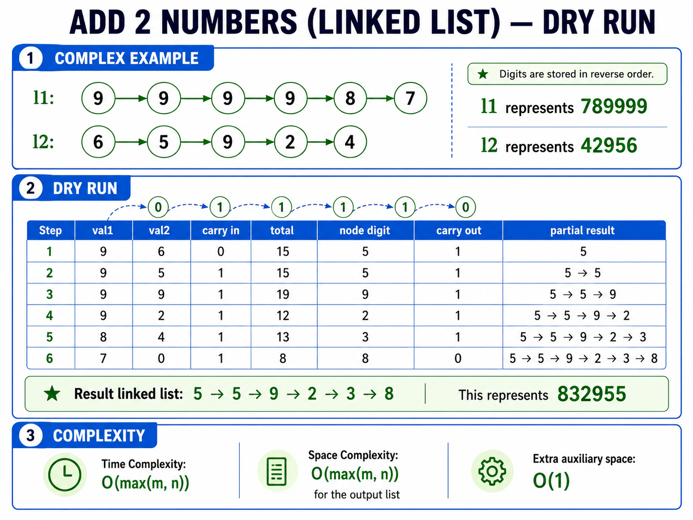

```python
class Solution:
    def addTwoNumbers(self, l1, l2):
        # Step 1: Initialize the carry value.
        carry = 0

        # Step 2: Create a dummy node to simplify result construction.
        dummy = ListNode(0)
        curr = dummy

        # Step 3: Continue while either list has nodes or a carry remains.
        while l1 or l2 or carry:
            # Step 4: Read the current digit from the first list.
            val1 = l1.val if l1 is not None else 0

            # Step 5: Read the current digit from the second list.
            val2 = l2.val if l2 is not None else 0

            # Step 6: Add both digits and the previous carry.
            total = val1 + val2 + carry

            # Step 7: Calculate the carry for the next position.
            carry = total // 10

            # Step 8: Store the current result digit.
            curr.next = ListNode(total % 10)
            curr = curr.next

            # Step 9: Move both input pointers forward when possible.
            if l1 is not None:
                l1 = l1.next

            if l2 is not None:
                l2 = l2.next

        # Step 10: Return the list after the dummy node.
        return dummy.next
```

- Time: `O(max(m, n))`
- Auxiliary space: `O(1)`, excluding the output list

---

## 4. Merge Two Sorted Linked Lists

[LeetCode 21](https://leetcode.com/problems/merge-two-sorted-lists/)

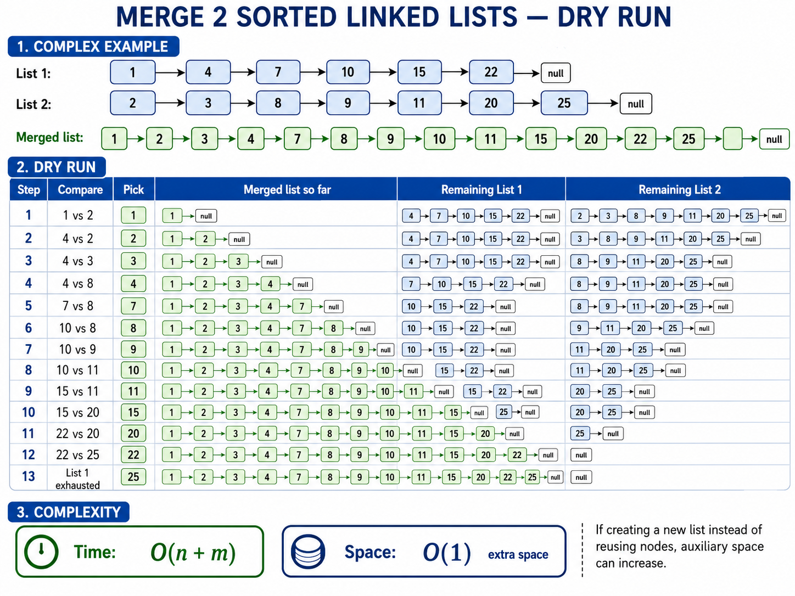

```python
class Solution:
    def mergeTwoLists(self, list1, list2):
        l1 = list1
        l2 = list2
        dummy = ListNode(0)
        temp = dummy

        while l1 and l2:
            if l1.val <= l2.val:
                temp.next = l1
                l1 = l1.next

            else:
                temp.next = l2
                l2 = l2.next

            temp = temp.next

        temp.next = l1 if l1 else l2

        return dummy.next
```

- Time: `O(m + n)`
- Space: `O(1)`

---

## 5. Intersection Point of Two Linked Lists

[LeetCode 160](https://leetcode.com/problems/intersection-of-two-linked-lists/)

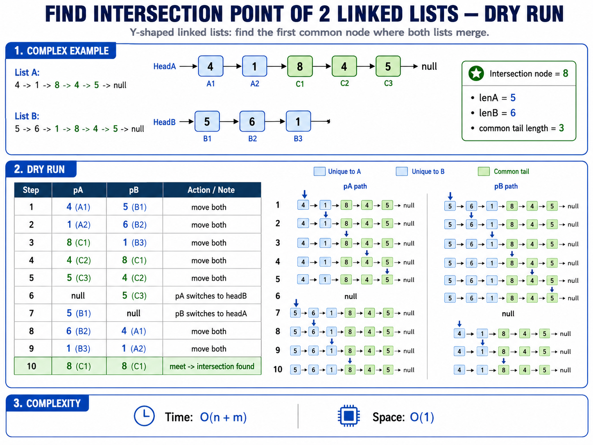

```python
class Solution:
    def getIntersectionNode(self, headA, headB):
        # Step 1: If either list is empty, no intersection is possible.
        if headA is None or headB is None:
            return None

        # Step 2: Start one pointer at each list head.
        curr1 = headA
        curr2 = headB

        # Step 3: Move both pointers until they point to the same node.
        while curr1 != curr2:
            # Step 4: When curr1 reaches the end of list A,
            # redirect it to the head of list B.
            curr1 = curr1.next if curr1 else headB

            # Step 5: When curr2 reaches the end of list B,
            # redirect it to the head of list A.
            curr2 = curr2.next if curr2 else headA

        # Step 6: Both pointers now meet at the intersection,
        # or both are None when no intersection exists.
        return curr1
```

- Time: `O(m + n)`
- Space: `O(1)`

---

## 6. Remove Nth Node From the End

[LeetCode 19](https://leetcode.com/problems/remove-nth-node-from-end-of-list/)

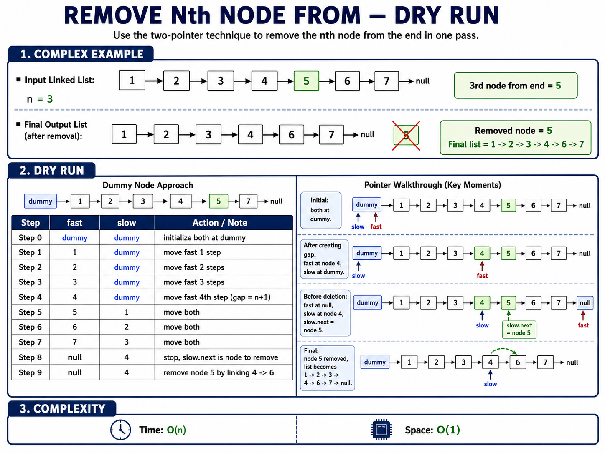

```python
class Solution:
    def removeNthFromEnd(self, head, n):
        # Step 1: Create a dummy node before the head.
        # This also handles removing the original head node.
        dummy = ListNode(0)
        dummy.next = head

        # Step 2: Start slow and fast pointers at the dummy node.
        slow = fast = dummy

        # Step 3: Move fast n steps ahead.
        for _ in range(n):
            fast = fast.next

        # Step 4: Move both pointers until fast reaches the last node.
        # Slow will stop immediately before the node to remove.
        while fast.next:
            slow = slow.next
            fast = fast.next

        # Step 5: Remove slow.next by bypassing it.
        slow.next = slow.next.next

        # Step 6: Return the possibly updated head.
        return dummy.next
```

- Time: `O(n)`
- Space: `O(1)`

---

## 7. Clone a Linked List With Next and Random Pointers

[LeetCode 138](https://leetcode.com/problems/copy-list-with-random-pointer/)

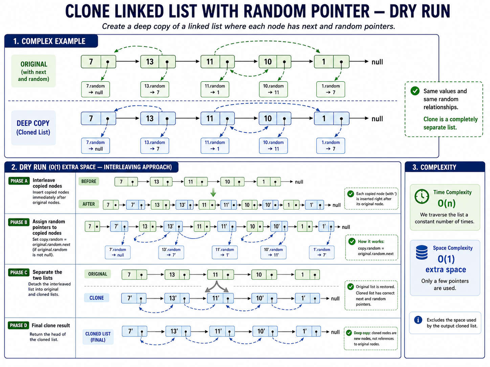

```python
class Solution:
    def copyRandomList(self, head):
        # Step 1: Handle an empty list.
        if head is None:
            return None

        # Step 2: Start from the original head.
        temp = head

        # Step 3: Insert every copied node immediately
        # after its corresponding original node.
        while temp:
            front = temp.next
            copy = Node(temp.val)

            temp.next = copy
            copy.next = front

            temp = front

        # Step 4: Restart traversal from the original head.
        temp = head

        # Step 5: Assign random pointers for copied nodes.
        while temp:
            copy = temp.next

            # Step 6: The copy of temp.random is temp.random.next.
            if temp.random:
                copy.random = temp.random.next

            temp = copy.next

        # Step 7: Save the head of the copied list.
        temp = head
        copy_head = head.next

        # Step 8: Separate the interleaved original and copied lists.
        while temp:
            copy = temp.next
            front = copy.next

            # Step 9: Restore the original list's next pointer.
            temp.next = front

            # Step 10: Connect the copied node to the next copied node.
            copy.next = front.next if front else None

            temp = front

        # Step 11: Return the completely separate cloned list.
        return copy_head
```

- Time: `O(n)`
- Auxiliary space: `O(1)`, excluding the cloned list

---

## 8. Flatten a Linked List Using Next and Child Pointers

This version contains multiple sorted vertical lists connected by `next`. The final sorted list is connected through `child`.

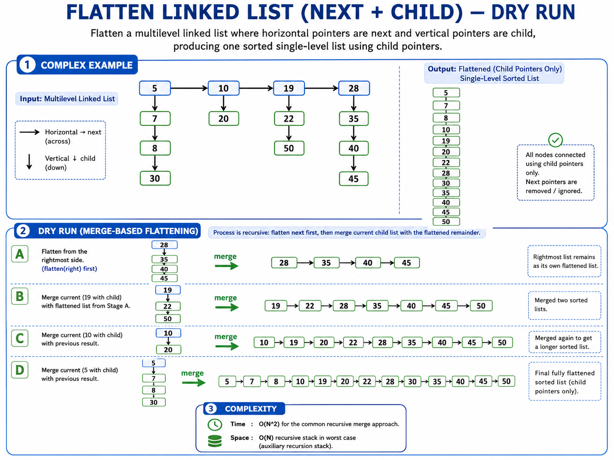

```python
class Solution:
    def merge(self, list1, list2):
        # Step 1: Create a dummy node for the merged child list.
        dummy = Node(-1)
        temp = dummy

        # Step 2: Merge both sorted child chains.
        while list1 and list2:
            # Step 3: Attach the smaller node from list1.
            if list1.data <= list2.data:
                temp.child = list1
                list1 = list1.child

            # Step 4: Otherwise, attach the smaller node from list2.
            else:
                temp.child = list2
                list2 = list2.child

            # Step 5: Move the result pointer forward.
            temp = temp.child

            # Step 6: Remove horizontal next links from the flattened list.
            temp.next = None

        # Step 7: Attach the remaining child chain.
        temp.child = list1 if list1 else list2

        # Step 8: Return the merged child list after the dummy node.
        return dummy.child

    def flatten(self, head):
        # Step 1: Handle an empty list or the last vertical list.
        if head is None or head.next is None:
            return head

        # Step 2: Recursively flatten all lists to the right.
        flattened_right = self.flatten(head.next)

        # Step 3: Disconnect the current node from the horizontal chain.
        head.next = None

        # Step 4: Merge the current child list with the flattened remainder.
        return self.merge(head, flattened_right)
```

- Time: up to `O(n²)` for the common recursive merge approach
- Recursive space: `O(n)` in the worst case

---

## 9. Flatten a Multilevel Doubly Linked List

[LeetCode 430](https://leetcode.com/problems/flatten-a-multilevel-doubly-linked-list/)

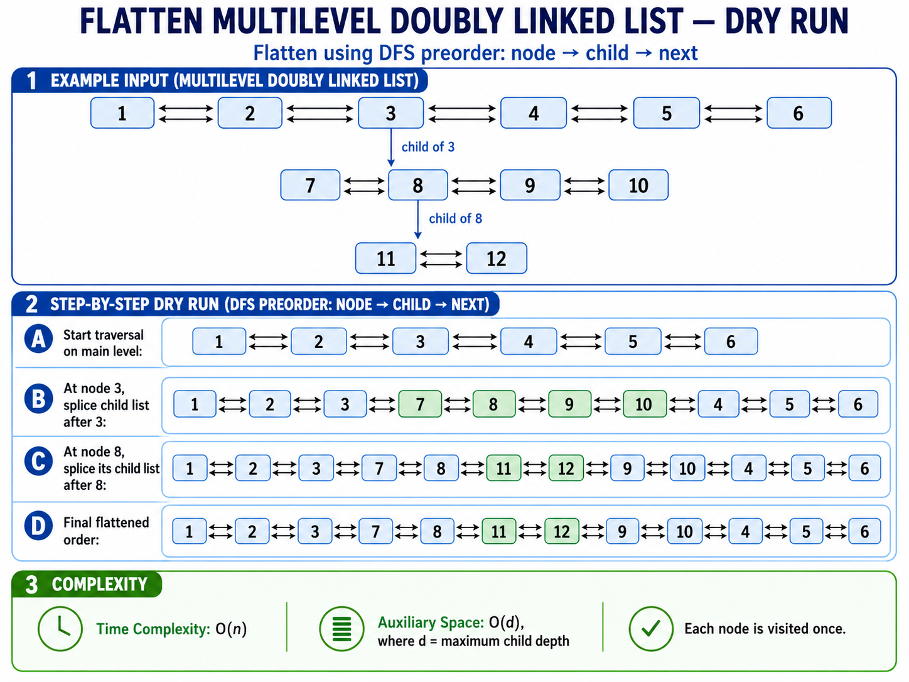

```python
class Solution:
    def flatten(self, head):
        # Step 1: Handle an empty list.
        if head is None:
            return None

        def flattenLevel(node):
            # Step 2: Start traversing the current level.
            temp = node
            tail = node

            # Step 3: Process each node in the current level.
            while temp:
                # Step 4: Save the original next node before flattening a child.
                front = temp.next

                # Step 5: If the current node has a child list,
                # recursively flatten that child list.
                if temp.child:
                    child_head = temp.child
                    child_tail = flattenLevel(child_head)

                    # Step 6: Insert the flattened child list after temp.
                    temp.next = child_head
                    child_head.prev = temp
                    temp.child = None

                    # Step 7: Reconnect the original next portion
                    # after the tail of the flattened child list.
                    if front:
                        child_tail.next = front
                        front.prev = child_tail

                    # Step 8: Update the current tail.
                    tail = child_tail

                else:
                    # Step 9: Without a child, temp is the latest tail.
                    tail = temp

                # Step 10: Continue with the original next node.
                temp = front

            # Step 11: Return the tail of this flattened level.
            return tail

        # Step 12: Flatten the complete list starting at head.
        flattenLevel(head)

        # Step 13: Return the unchanged head pointer.
        return head
```

- Time: `O(n)`
- Recursive space: `O(d)`, where `d` is the maximum child depth

---

## 10. Rotate a Linked List to the Right by K

[LeetCode 61](https://leetcode.com/problems/rotate-list/)

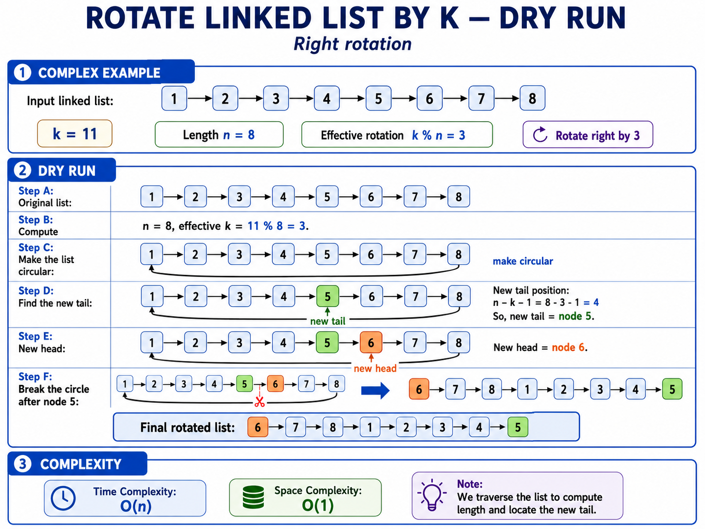

```python
class Solution:
    def rotateRight(self, head, k):
        # Step 1: Handle empty, single-node, or zero-rotation cases.
        if head is None or head.next is None or k == 0:
            return head

        # Step 2: Find the list length and its tail node.
        length = 1
        tail = head

        while tail.next:
            tail = tail.next
            length += 1

        # Step 3: Remove unnecessary full rotations.
        k %= length

        # Step 4: If k becomes zero, the list remains unchanged.
        if k == 0:
            return head

        # Step 5: Connect the tail to the head to form a circle.
        tail.next = head

        # Step 6: Find the node that will become the new tail.
        steps_to_new_tail = length - k - 1
        new_tail = head

        for _ in range(steps_to_new_tail):
            new_tail = new_tail.next

        # Step 7: The node after new_tail becomes the new head.
        new_head = new_tail.next

        # Step 8: Break the circle after the new tail.
        new_tail.next = None

        # Step 9: Return the rotated list.
        return new_head
```

- Time: `O(n)`
- Space: `O(1)`

---

## 11. Reverse Nodes in K-Group

[LeetCode 25](https://leetcode.com/problems/reverse-nodes-in-k-group/)

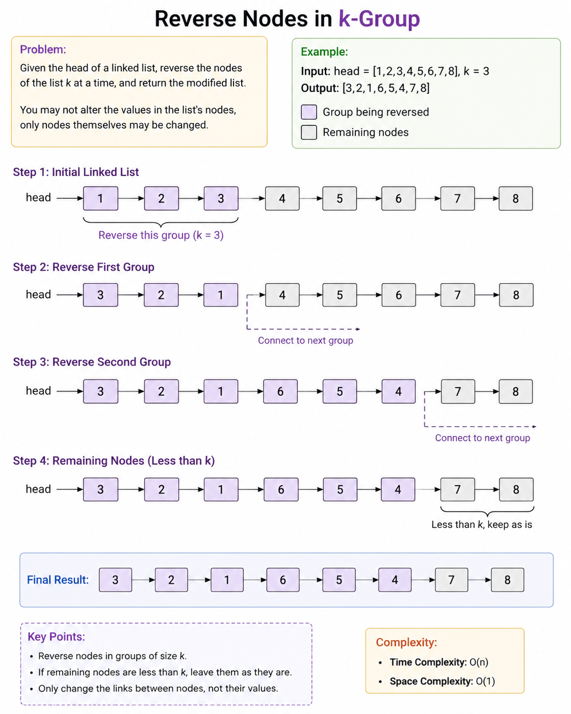

```python
class Solution:
    def reverseKGroup(self, head, k):
        # Step 1: Handle an empty list or groups of size one.
        if head is None or k == 1:
            return head

        # Step 2: Check whether the first complete group of k nodes exists.
        temp = head

        for _ in range(k - 1):
            if temp is None:
                return head

            temp = temp.next

        # Step 3: If fewer than k nodes exist, leave the list unchanged.
        if temp is None:
            return head

        # Step 4: The kth node becomes the new head after first reversal.
        newHead = temp

        # Step 5: Initialize pointers used to process each group.
        groupHead = head
        prevGroup = None

        # Step 6: Process one group at a time.
        while groupHead:
            temp = groupHead
            i = 0

            # Step 7: Verify that a complete group of k nodes remains.
            while i < k:
                if temp is None:
                    return newHead

                temp = temp.next
                i += 1

            # Step 8: Save the first node of the next group.
            nextGroup = temp

            # Step 9: Reverse the current group.
            temp = groupHead
            prev = nextGroup
            i = 0

            while i < k:
                front = temp.next
                temp.next = prev
                prev = temp
                temp = front
                i += 1

            # Step 10: Connect the previously reversed group
            # to the head of the current reversed group.
            if prevGroup:
                prevGroup.next = prev

            # Step 11: The old group head is now the group's tail.
            prevGroup = groupHead

            # Step 12: Move to the next group.
            groupHead = nextGroup

        # Step 13: Return the new head of the full list.
        return newHead
```

- Time: `O(n)`
- Space: `O(1)`
