# Stack and Design Problems — Python Notes

---

## 1. Valid Parentheses

[LeetCode 20](https://leetcode.com/problems/valid-parentheses/)

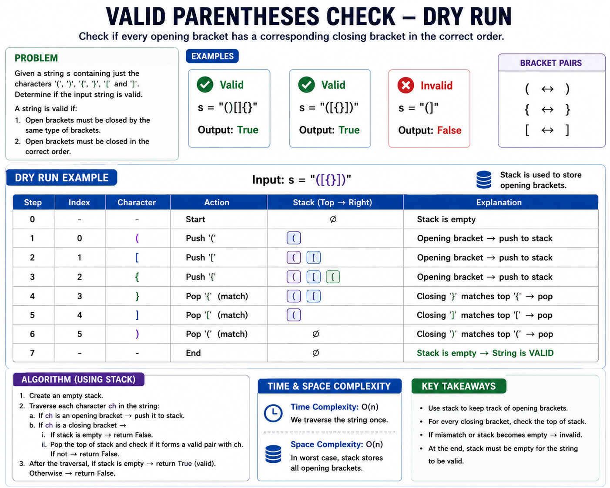

```python
class Solution:
    def isValid(self, s: str) -> bool:
        stack = []

        hashmap = {
            ")": "(",
            "]": "[",
            "}": "{"
        }

        for char in s:
            if char in hashmap:
                if not stack or stack[-1] != hashmap[char]:
                    return False

                stack.pop()
            else:
                stack.append(char)

        return len(stack) == 0
```

**Time:** `O(n)`  
**Space:** `O(n)`

---

## 2. Min Stack

[LeetCode 155](https://leetcode.com/problems/min-stack/)

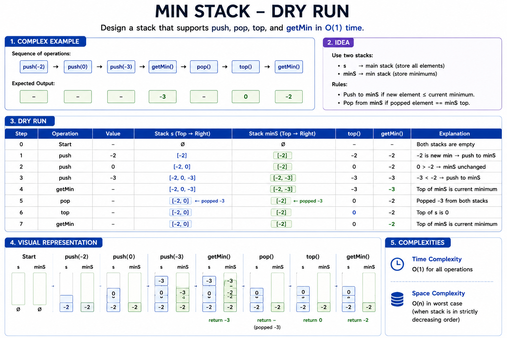

```python
class MinStack:

    def __init__(self):
        self.stack = []
        self.min_stack = []

    def push(self, val: int) -> None:
        self.stack.append(val)

        if not self.min_stack or val <= self.min_stack[-1]:
            self.min_stack.append(val)

    def pop(self) -> None:
        value = self.stack.pop()

        if value == self.min_stack[-1]:
            self.min_stack.pop()

    def top(self) -> int:
        return self.stack[-1]

    def getMin(self) -> int:
        return self.min_stack[-1]
```

**Time:** `O(1)` for every operation  
**Space:** `O(n)`

---

## 3. Next Greater and Next Smaller Element

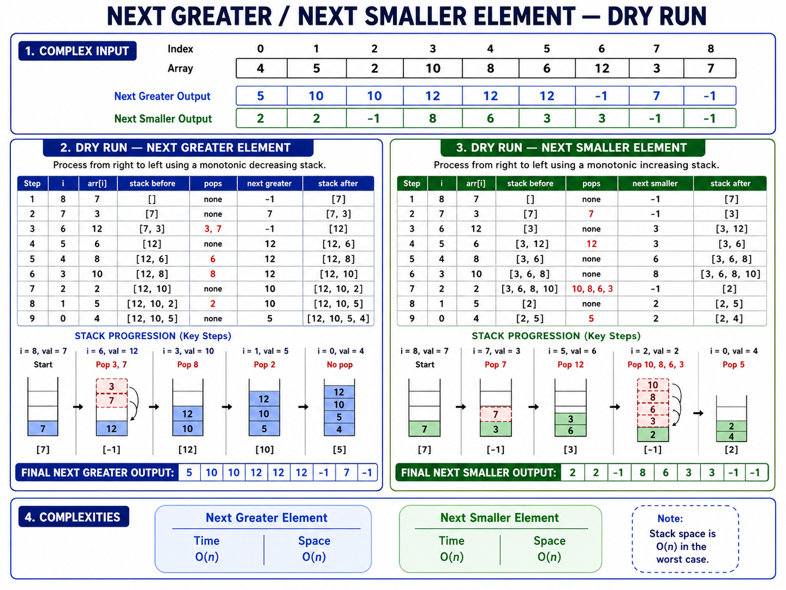

```python
class Solution:
    def nextGreaterElement(self, nums: list[int]) -> list[int]:
        answer = [-1] * len(nums)
        stack = []

        for i in range(len(nums) - 1, -1, -1):
            while stack and stack[-1] <= nums[i]:
                stack.pop()

            if stack:
                answer[i] = stack[-1]

            stack.append(nums[i])

        return answer

    def nextSmallerElement(self, nums: list[int]) -> list[int]:
        answer = [-1] * len(nums)
        stack = []

        for i in range(len(nums) - 1, -1, -1):
            while stack and stack[-1] >= nums[i]:
                stack.pop()

            if stack:
                answer[i] = stack[-1]

            stack.append(nums[i])

        return answer
```

**Time:** `O(n)` for each method  
**Space:** `O(n)`

---

## 4. Next Greater Element II

[LeetCode 503](https://leetcode.com/problems/next-greater-element-ii/)

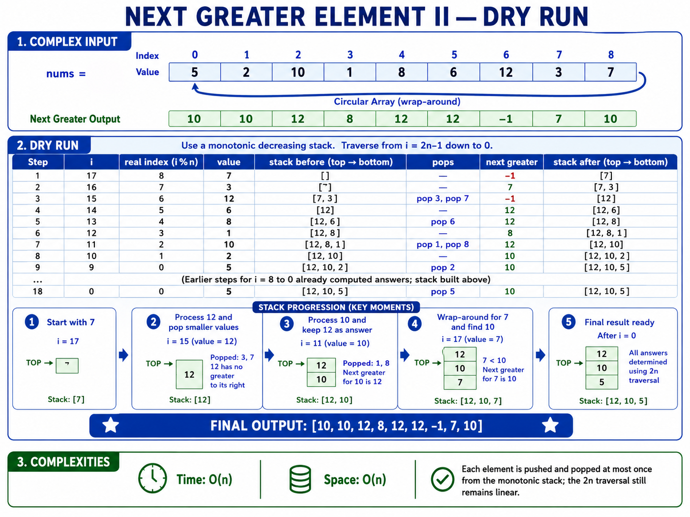

```python
class Solution:
    def nextGreaterElements(self, nums: list[int]) -> list[int]:
        n = len(nums)
        answer = [-1] * n
        stack = []

        for i in range(2 * n - 1, -1, -1):
            index = i % n

            while stack and stack[-1] <= nums[index]:
                stack.pop()

            if i < n and stack:
                answer[index] = stack[-1]

            stack.append(nums[index])

        return answer
```

**Time:** `O(n)`  
**Space:** `O(n)`

---

## 5. Largest Rectangle in Histogram

[LeetCode 84](https://leetcode.com/problems/largest-rectangle-in-histogram/)

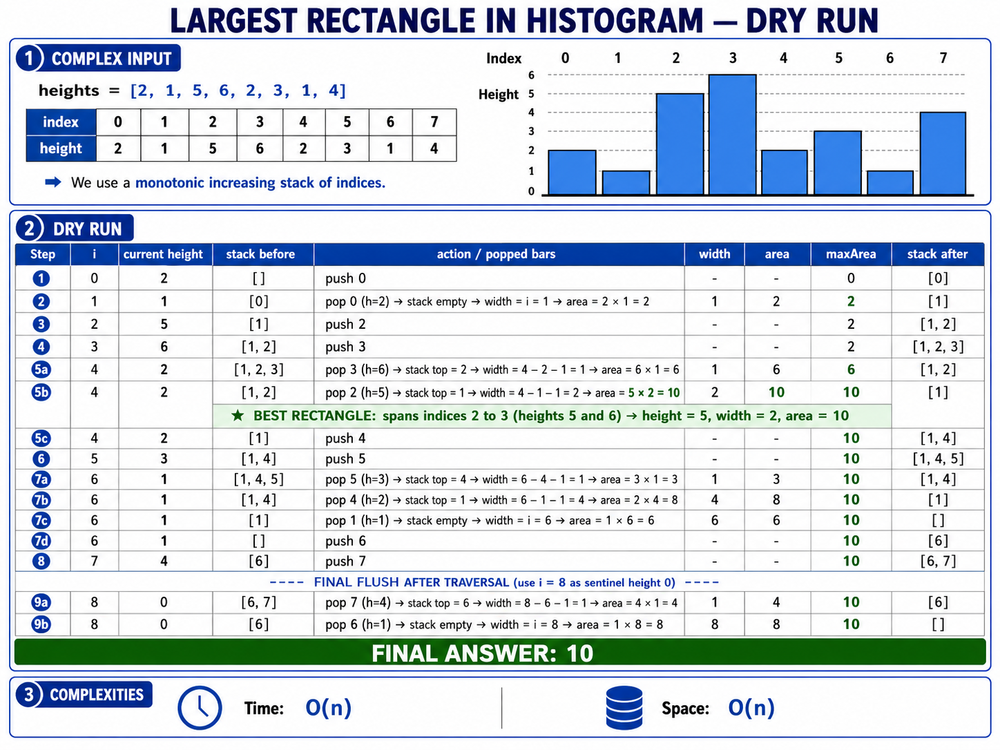

```python
class Solution:
    def largestRectangleArea(self, heights: list[int]) -> int:
        stack = []
        max_area = 0
        n = len(heights)

        for i in range(n + 1):
            current_height = 0 if i == n else heights[i]

            while stack and heights[stack[-1]] > current_height:
                height = heights[stack.pop()]

                if stack:
                    width = i - stack[-1] - 1
                else:
                    width = i

                max_area = max(max_area, height * width)

            stack.append(i)

        return max_area
```

**Time:** `O(n)`  
**Space:** `O(n)`

---

## 6. Trapping Rain Water

[LeetCode 42](https://leetcode.com/problems/trapping-rain-water/)

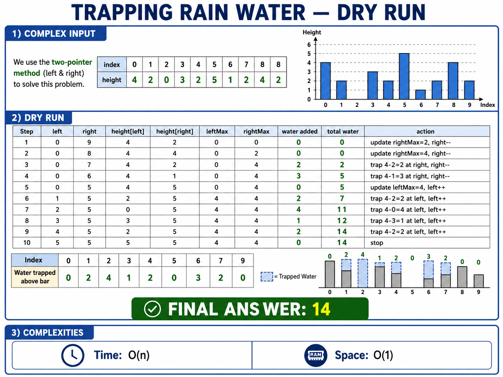

```python
class Solution:
    def trap(self, height: list[int]) -> int:
        left = 0
        right = len(height) - 1

        left_max = 0
        right_max = 0
        water = 0

        while left < right:
            if height[left] <= height[right]:
                if height[left] >= left_max:
                    left_max = height[left]
                else:
                    water += left_max - height[left]

                left += 1

            else:
                if height[right] >= right_max:
                    right_max = height[right]
                else:
                    water += right_max - height[right]

                right -= 1

        return water
```

**Time:** `O(n)`  
**Space:** `O(1)`

---

## 7. Maximal Rectangle

[LeetCode 85](https://leetcode.com/problems/maximal-rectangle/)

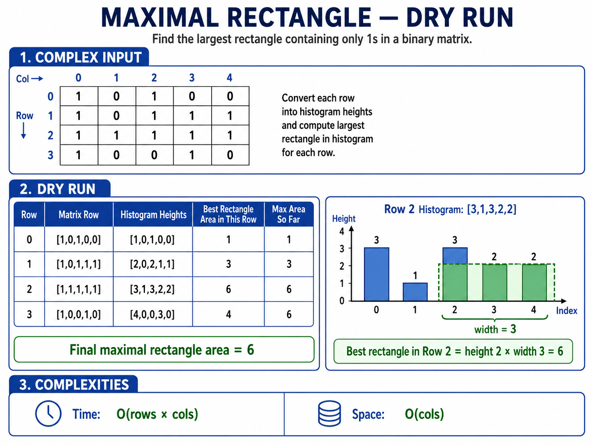

```python
class Solution:
    def largestRectangleArea(self, heights: list[int]) -> int:
        stack = []
        max_area = 0

        for i in range(len(heights) + 1):
            current_height = 0 if i == len(heights) else heights[i]

            while stack and heights[stack[-1]] > current_height:
                height = heights[stack.pop()]
                width = i if not stack else i - stack[-1] - 1
                max_area = max(max_area, height * width)

            stack.append(i)

        return max_area

    def maximalRectangle(self, matrix: list[list[str]]) -> int:
        if not matrix:
            return 0

        heights = [0] * len(matrix[0])
        max_area = 0

        for row in matrix:
            for col in range(len(row)):
                if row[col] == "1":
                    heights[col] += 1
                else:
                    heights[col] = 0

            max_area = max(max_area, self.largestRectangleArea(heights))

        return max_area
```

**Time:** `O(rows × cols)`  
**Space:** `O(cols)`

---

## 8. Remove K Digits

[LeetCode 402](https://leetcode.com/problems/remove-k-digits/)

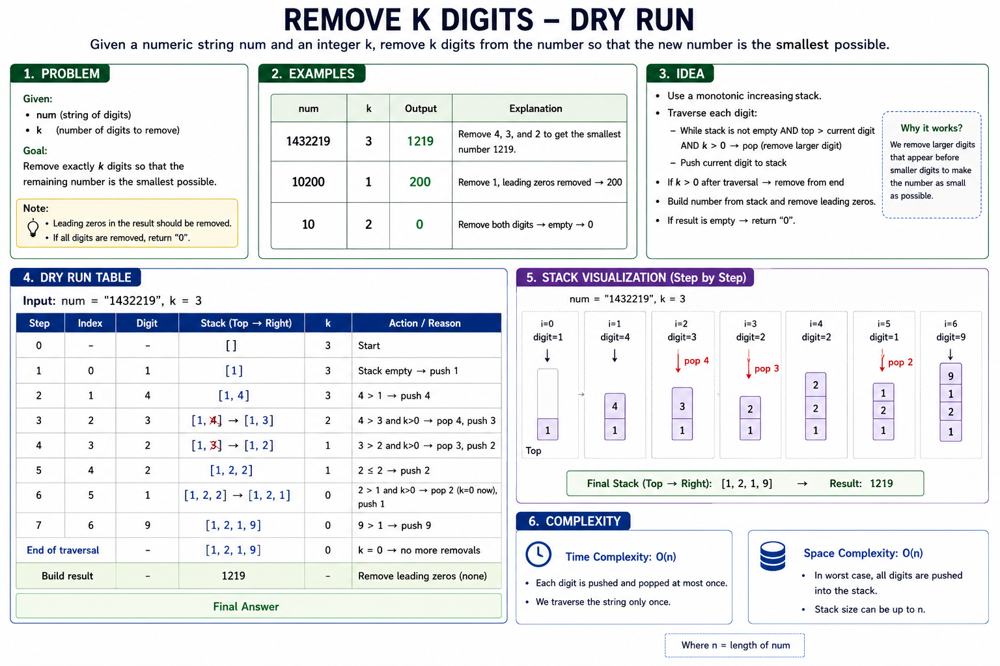

```python
class Solution:
    def removeKdigits(self, num: str, k: int) -> str:
        stack = []

        for digit in num:
            while stack and k > 0 and stack[-1] > digit:
                stack.pop()
                k -= 1

            stack.append(digit)

        if k > 0:
            stack = stack[:-k]

        answer = "".join(stack).lstrip("0")

        return answer if answer else "0"
```

**Time:** `O(n)`  
**Space:** `O(n)`

---

## 9. Daily Temperatures

[LeetCode 739](https://leetcode.com/problems/daily-temperatures/)

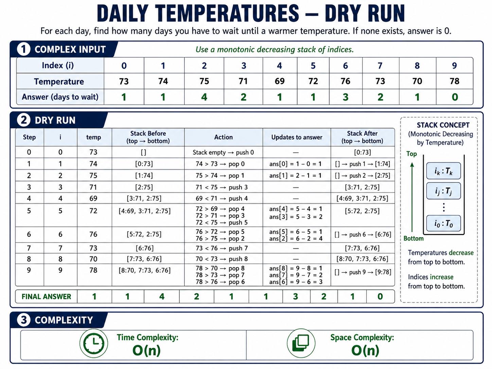

```python
class Solution:
    def dailyTemperatures(self, temperatures: list[int]) -> list[int]:
        answer = [0] * len(temperatures)
        stack = []

        for i, temperature in enumerate(temperatures):
            while stack and temperatures[stack[-1]] < temperature:
                previous_index = stack.pop()
                answer[previous_index] = i - previous_index

            stack.append(i)

        return answer
```

**Time:** `O(n)`  
**Space:** `O(n)`

---

## 10. Evaluate Reverse Polish Notation

[LeetCode 150](https://leetcode.com/problems/evaluate-reverse-polish-notation/)

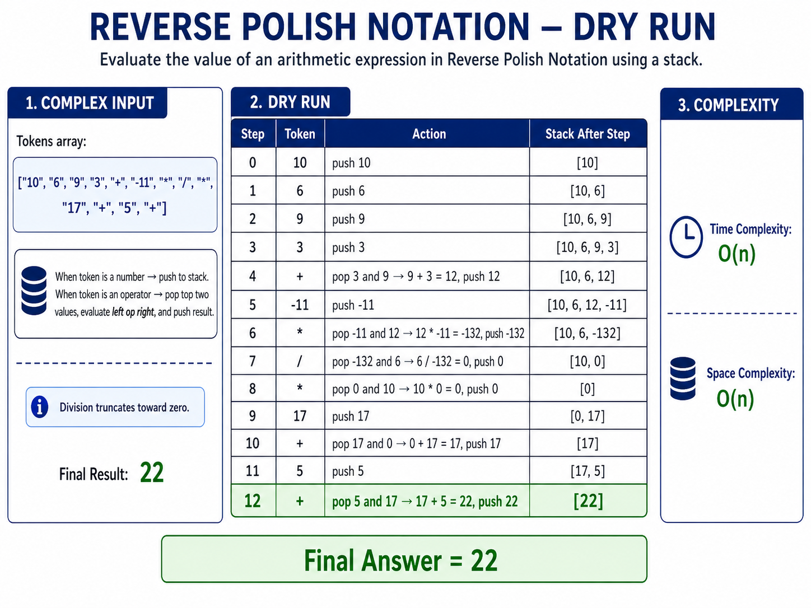

```python
class Solution:
    def evalRPN(self, tokens: list[str]) -> int:
        stack = []
        operators = {"+", "-", "*", "/"}

        for token in tokens:
            if token not in operators:
                stack.append(int(token))
                continue

            right = stack.pop()
            left = stack.pop()

            if token == "+":
                result = left + right
            elif token == "-":
                result = left - right
            elif token == "*":
                result = left * right
            else:
                result = int(left / right)

            stack.append(result)

        return stack[-1]
```

**Time:** `O(n)`  
**Space:** `O(n)`

---

## 11. LRU Cache

[LeetCode 146](https://leetcode.com/problems/lru-cache/)

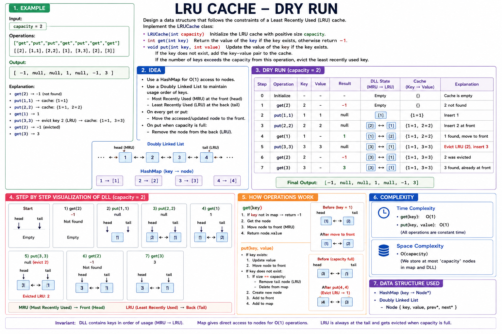

```python
class Node:

    def __init__(self, key=0, value=0):
        self.key = key
        self.value = value
        self.prev = None
        self.next = None


class LRUCache:

    def __init__(self, capacity: int):
        self.capacity = capacity
        self.hashmap = {}

        self.left = Node()
        self.right = Node()

        self.left.next = self.right
        self.right.prev = self.left

    def remove(self, node: Node) -> None:
        prev_node = node.prev
        next_node = node.next

        prev_node.next = next_node
        next_node.prev = prev_node

    def insertAtFront(self, node: Node) -> None:
        front = self.left.next

        self.left.next = node
        node.prev = self.left

        node.next = front
        front.prev = node

    def get(self, key: int) -> int:
        if key not in self.hashmap:
            return -1

        node = self.hashmap[key]

        self.remove(node)
        self.insertAtFront(node)

        return node.value

    def put(self, key: int, value: int) -> None:
        if key in self.hashmap:
            node = self.hashmap[key]
            node.value = value

            self.remove(node)
            self.insertAtFront(node)
            return

        node = Node(key, value)
        self.hashmap[key] = node
        self.insertAtFront(node)

        if len(self.hashmap) > self.capacity:
            least_recent = self.right.prev

            self.remove(least_recent)
            del self.hashmap[least_recent.key]
```

**Time:** `O(1)` for `get` and `put`  
**Space:** `O(capacity)`

---

## 12. Design Browser History

[LeetCode 1472](https://leetcode.com/problems/design-browser-history/)

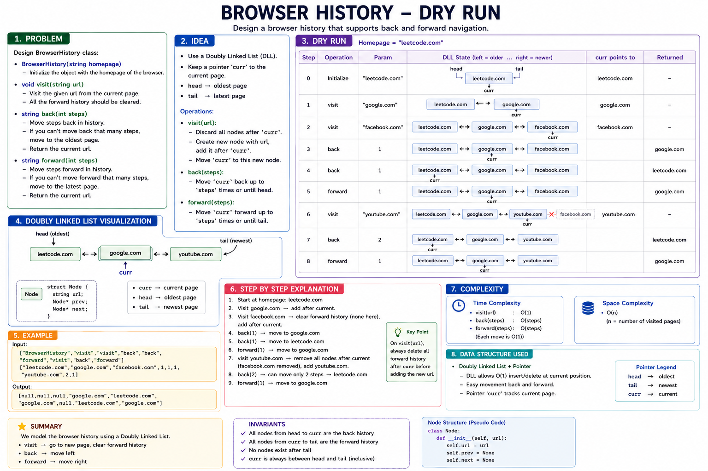

```python
class Node:

    def __init__(self, url: str):
        self.url = url
        self.prev = None
        self.next = None


class BrowserHistory:

    def __init__(self, homepage: str):
        self.current = Node(homepage)

    def visit(self, url: str) -> None:
        node = Node(url)

        self.current.next = node
        node.prev = self.current

        self.current = node

    def back(self, steps: int) -> str:
        while self.current.prev and steps > 0:
            self.current = self.current.prev
            steps -= 1

        return self.current.url

    def forward(self, steps: int) -> str:
        while self.current.next and steps > 0:
            self.current = self.current.next
            steps -= 1

        return self.current.url
```

**Time:**
- `visit`: `O(1)`
- `back`: `O(steps)`
- `forward`: `O(steps)`

**Space:** `O(n)`
