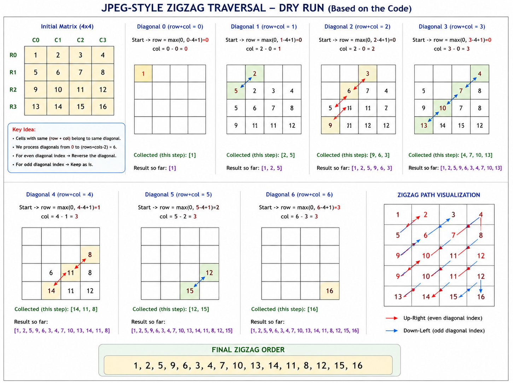

```python

class Solution:
def jpegZigzagTraversal(self, matrix: List[List[int]]) -> List[int]:
rows = len(matrix)
cols = len(matrix[0])

        result = []

        # Each diagonal has the same value of row + col
        for diagonal in range(rows + cols - 1):

            current_diagonal = []

            row = max(0, diagonal - cols + 1)
            col = diagonal - row

            while row < rows and col >= 0:
                current_diagonal.append(matrix[row][col])
                row += 1
                col -= 1

            # Reverse every even-numbered diagonal
            if diagonal % 2 == 0:
                current_diagonal.reverse()

            result.extend(current_diagonal)

        return result
```
