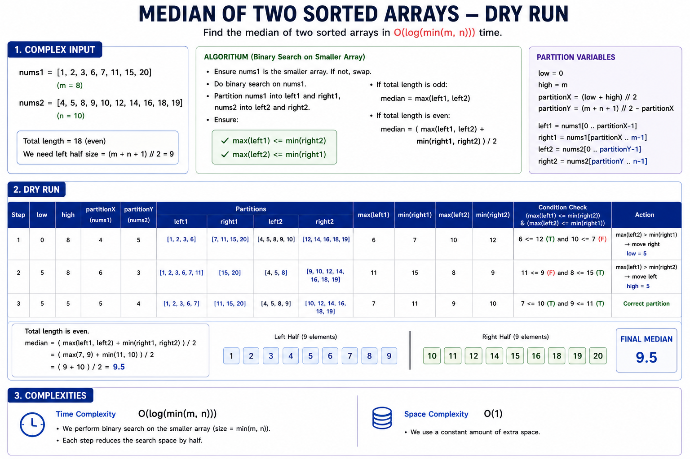
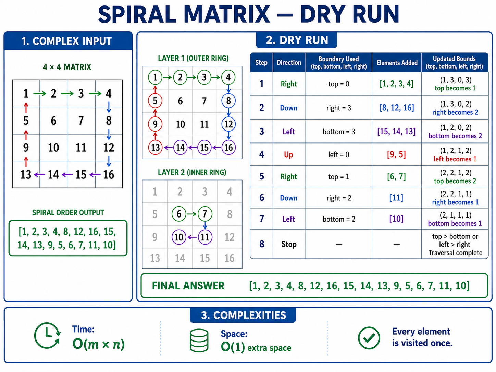
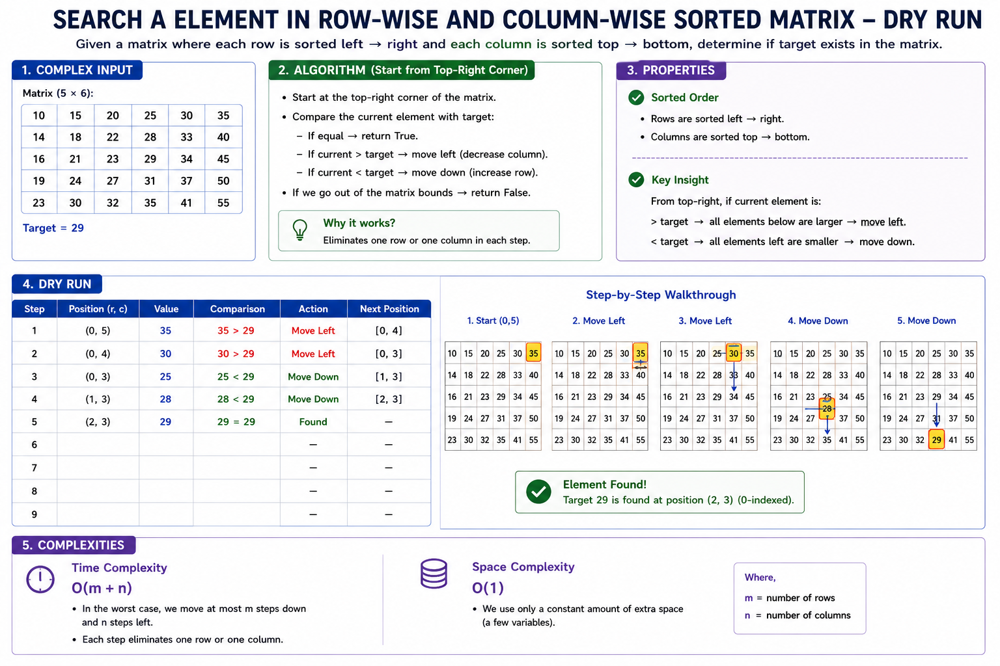
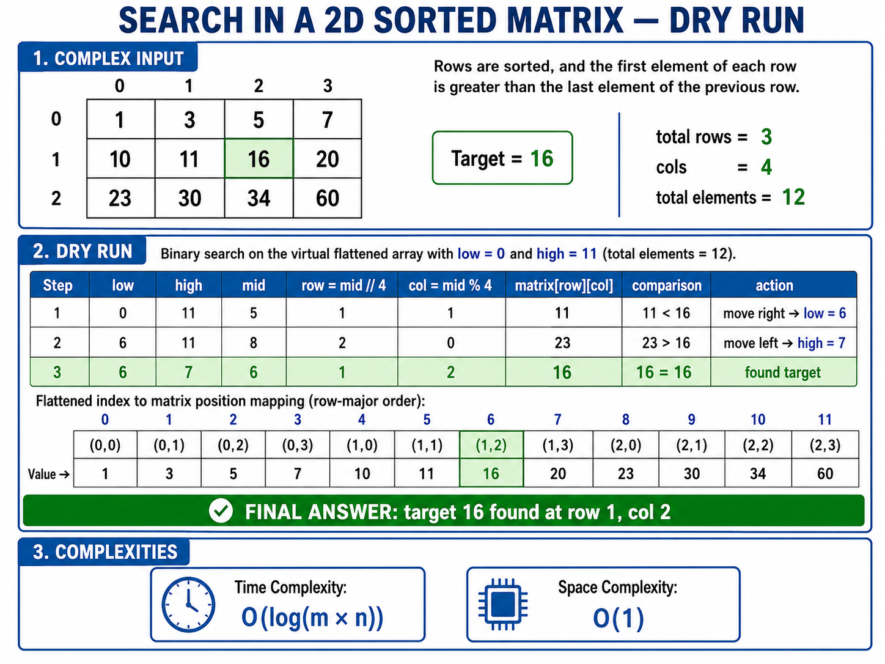
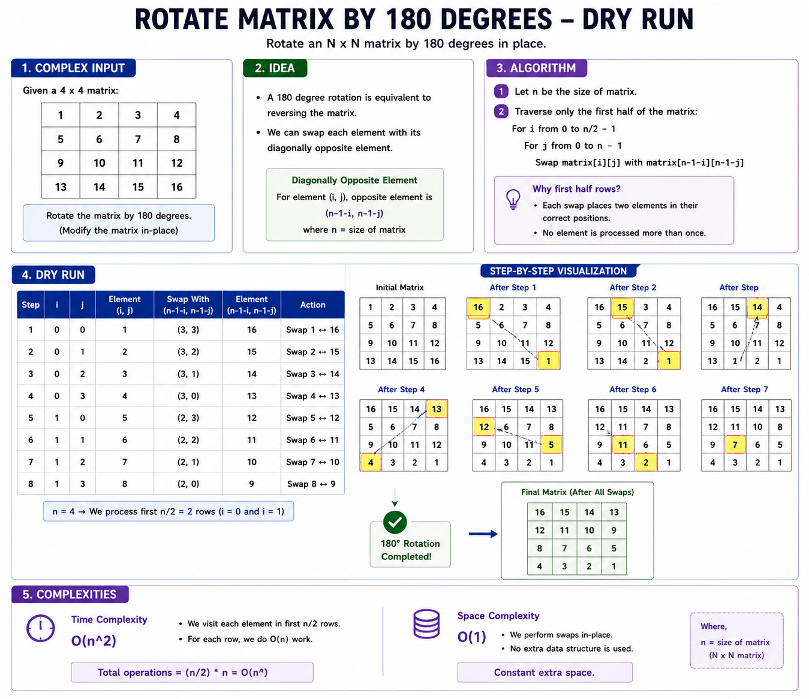
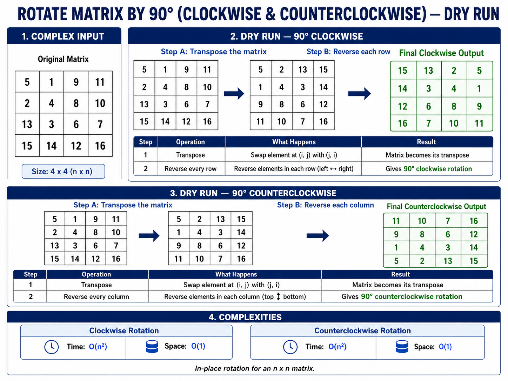
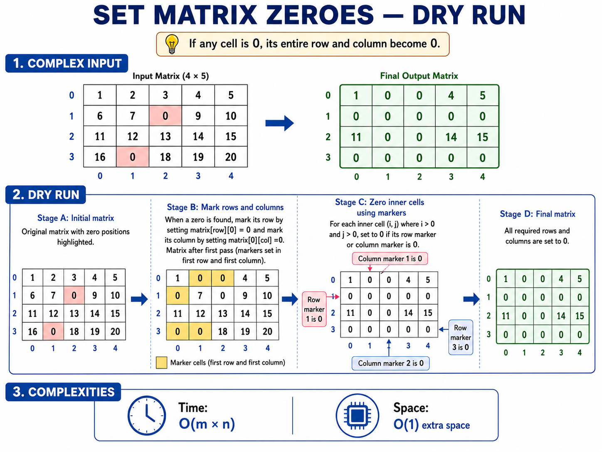
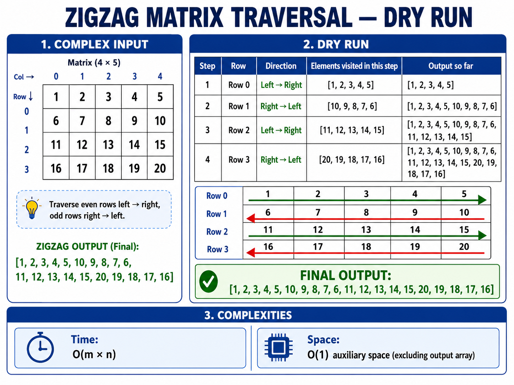
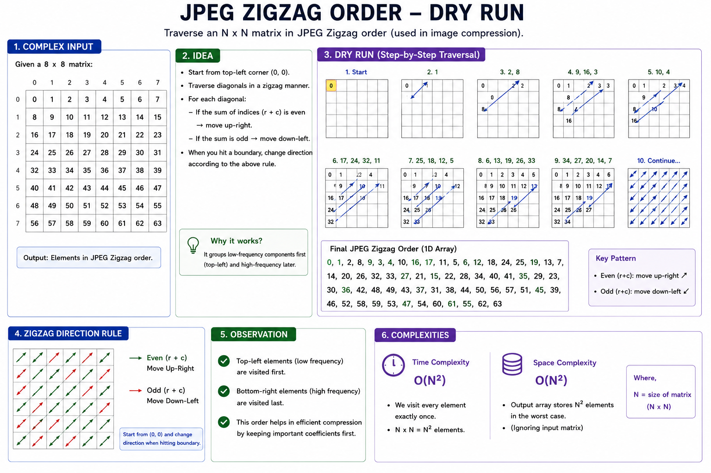

# Matrix Problems — Python Code and Dry-Run Images

---

## 1. Median of Two Sorted Arrays

[LeetCode 4](https://leetcode.com/problems/median-of-two-sorted-arrays/)



**Question:** Given two sorted arrays `nums1` and `nums2`, return the **median** of the two sorted arrays.

The overall runtime complexity should be `O(log(min(m, n)))`, where `m` and `n` are the lengths of the two arrays.

### Example

```text
Input:
nums1 = [1,3]
nums2 = [2]

Merged view:
[1,2,3]

Output: 2.0
```

Another example:

```text
Input:
nums1 = [1,2], nums2 = [3,4]

Merged view:
[1,2,3,4]

Output: 2.5
```

```python
class Solution:
    def findMedianSortedArrays(self,nums1: list[int],nums2: list[int]) -> float:

        if len(nums1) > len(nums2):
            nums1, nums2 = nums2, nums1

        m = len(nums1)
        n = len(nums2)

        low = 0
        high = m
        left_size = (m + n + 1) // 2

        while low <= high:
            partition1 = (low + high) // 2
            partition2 = left_size - partition1

            max_left1 = (float("-inf") if partition1 == 0 else nums1[partition1 - 1])

            min_right1 = (float("inf") if partition1 == m else nums1[partition1])

            max_left2 = (float("-inf") if partition2 == 0 else nums2[partition2 - 1])

            min_right2 = (float("inf") if partition2 == n else nums2[partition2])

            if max_left1 <= min_right2 and max_left2 <= min_right1:
                if (m + n) % 2 == 1:
                    return float(max(max_left1, max_left2))

                left_max = max(max_left1, max_left2)
                right_min = min(min_right1, min_right2)

                return (left_max + right_min) / 2

            if max_left1 > min_right2:
                high = partition1 - 1
            else:
                low = partition1 + 1

        raise ValueError("Input arrays must be sorted.")
```

- Time: `O(log(min(m, n)))`
- Space: `O(1)`

---

## 2. Spiral Matrix

[LeetCode 54](https://leetcode.com/problems/spiral-matrix/)



**Question:** Given an `m × n` matrix, return all elements of the matrix in **spiral order**.

### Example

```text
Input:
[
  [1,2,3],
  [4,5,6],
  [7,8,9]
]

Output:
[1,2,3,6,9,8,7,4,5]
```

Spiral direction:

```text
→ → →
    ↓
← ← ↓
↓
→
```

```python
class Solution:
    def spiralOrder(self, matrix: list[list[int]]) -> list[int]:
        if not matrix:
            return []

        top = 0
        bottom = len(matrix) - 1
        left = 0
        right = len(matrix[0]) - 1

        answer = []

        while top <= bottom and left <= right:

            for col in range(left, right + 1):
                answer.append(matrix[top][col])
            top += 1

            for row in range(top, bottom + 1):
                answer.append(matrix[row][right])
            right -= 1

            if top <= bottom:
                for col in range(right, left - 1, -1):
                    answer.append(matrix[bottom][col])
                bottom -= 1

            if left <= right:
                for row in range(bottom, top - 1, -1):
                    answer.append(matrix[row][left])
                left += 1

        return answer
```

- Time: `O(rows × cols)`
- Space: `O(1)` extra space, excluding the output

---

## 3. Search in a Row-Wise and Column-Wise Sorted Matrix

[LeetCode 240](https://leetcode.com/problems/search-a-2d-matrix-ii/)



**Question:** Given a matrix where:

- Every row is sorted in ascending order.
- Every column is sorted in ascending order.

Return `True` if `target` exists in the matrix, otherwise return `False`.

### Example

```text
Input:
matrix =
[
  [1,4,7,11,15],
  [2,5,8,12,19],
  [3,6,9,16,22],
  [10,13,14,17,24],
  [18,21,23,26,30]
]

target = 5

Output: True
```

The key starting position is the **top-right corner**.

```text
If current > target → move left
If current < target → move down
```

```python
class Solution:
    def searchMatrix(self, matrix: list[list[int]], target: int) -> bool:

        if not matrix or not matrix[0]:
            return False

        rows = len(matrix)
        cols = len(matrix[0])

        row = 0
        col = cols - 1

        while row < rows and col >= 0:

            if matrix[row][col] == target:
                return True

            if matrix[row][col] > target:
                col -= 1
            else:
                row += 1

        return False
```

- Time: `O(rows + cols)`
- Space: `O(1)`

---

## 4. Search in a 2D Sorted Matrix

[LeetCode 74](https://leetcode.com/problems/search-a-2d-matrix/)



**Question:** Given an `m × n` matrix where:

- Integers in each row are sorted from left to right.
- The first integer of each row is greater than the last integer of the previous row.

Return `True` if `target` exists, otherwise return `False`.

### Example

```text
Input:
matrix =
[
  [1,3,5,7],
  [10,11,16,20],
  [23,30,34,60]
]

target = 3

Output: True
```

Think of the matrix as one sorted 1D array:

```text
[1,3,5,7,10,11,16,20,23,30,34,60]
```

```python
class Solution:
    def searchMatrix(self, matrix: list[list[int]], target: int) -> bool:

        if not matrix or not matrix[0]:
            return False

        rows = len(matrix)
        cols = len(matrix[0])

        left = 0
        right = rows * cols - 1

        while left <= right:
            mid = (left + right) // 2
            row = mid // cols
            col = mid % cols
            value = matrix[row][col]

            if value == target:
                return True

            if value < target:
                left = mid + 1
            else:
                right = mid - 1

        return False
```

- Time: `O(log(rows × cols))`
- Space: `O(1)`

---

## 5. Rotate a Matrix by 180 Degrees



**Question:** Given a matrix, rotate it **180 degrees**.

The rotation should be done in-place.

### Example

```text
Input:
[
  [1,2,3],
  [4,5,6],
  [7,8,9]
]

Output:
[
  [9,8,7],
  [6,5,4],
  [3,2,1]
]
```

```python
class Solution:
    def rotate180(self, matrix: list[list[int]]) -> None:
        rows = len(matrix)
        cols = len(matrix[0])

        total = rows * cols

        for index in range(total // 2):
            row1 = index // cols
            col1 = index % cols

            opposite = total - 1 - index

            row2 = opposite // cols
            col2 = opposite % cols

            matrix[row1][col1], matrix[row2][col2] = (
                matrix[row2][col2],
                matrix[row1][col1]
            )
```

- Time: `O(rows × cols)`
- Space: `O(1)`

---

## 6. Rotate a Matrix by 90 Degrees



### Clockwise

**Question:** Given an `n × n` matrix, rotate it by **90 degrees**.

For clockwise rotation:

```text
Transpose matrix
      ↓
Reverse each row
```

For counterclockwise rotation:

```text
Transpose matrix
      ↓
Reverse row order
```

### Example — Clockwise

```text
Input:
[
  [1,2,3],
  [4,5,6],
  [7,8,9]
]

Output:
[
  [7,4,1],
  [8,5,2],
  [9,6,3]
]
```

### Example — Counterclockwise

```text
Input:
[
  [1,2,3],
  [4,5,6],
  [7,8,9]
]

Output:
[
  [3,6,9],
  [2,5,8],
  [1,4,7]
]
```

```python
class Solution:
    def rotateClockwise(self, matrix: list[list[int]]) -> None:
        n = len(matrix)

        for row in range(n):
            for col in range(row + 1, n):
                matrix[row][col], matrix[col][row] = (
                    matrix[col][row],
                    matrix[row][col])

        for row in matrix:
            row.reverse()
```

### Counterclockwise

```python
class Solution:
    def rotateCounterclockwise(self, matrix: list[list[int]]) -> None:
        n = len(matrix)

        for row in range(n):
            for col in range(row + 1, n):
                matrix[row][col], matrix[col][row] = (
                    matrix[col][row],
                    matrix[row][col])
                    
        top = 0
        bottom = n - 1

        while top < bottom:
            matrix[top], matrix[bottom] = matrix[bottom], matrix[top]
            top += 1
            bottom -= 1
```

- Time: `O(n²)`
- Space: `O(1)`

---

## 7. Set Matrix Zeroes

[LeetCode 73](https://leetcode.com/problems/set-matrix-zeroes/)



**Question:** Given an `m × n` integer matrix, if an element is `0`, set its **entire row and entire column to `0`**.

The update must be done in-place.

### Example

```text
Input:
[
  [1,1,1],
  [1,0,1],
  [1,1,1]
]

Output:
[
  [1,0,1],
  [0,0,0],
  [1,0,1]
]
```

```python
class Solution:
    def setZeroes(self, matrix: list[list[int]]) -> None:
        rows = len(matrix)
        cols = len(matrix[0])

        first_row_zero = False
        first_col_zero = False

        for col in range(cols):
            if matrix[0][col] == 0:
                first_row_zero = True
                break

        for row in range(rows):
            if matrix[row][0] == 0:
                first_col_zero = True
                break

        for row in range(1, rows):
            for col in range(1, cols):
                if matrix[row][col] == 0:
                    matrix[row][0] = 0
                    matrix[0][col] = 0

        for row in range(1, rows):
            for col in range(1, cols):
                if matrix[row][0] == 0 or matrix[0][col] == 0:
                    matrix[row][col] = 0

        if first_row_zero:
            for col in range(cols):
                matrix[0][col] = 0

        if first_col_zero:
            for row in range(rows):
                matrix[row][0] = 0
```

- Time: `O(rows × cols)`
- Space: `O(1)`

---

## 8. Row-Wise Zigzag Matrix Traversal



**Question:** Traverse the matrix row by row in a **zigzag pattern**:

- Even-indexed row → left to right
- Odd-indexed row → right to left

Return the traversal order.

### Example

```text
Input:
[
  [1,2,3],
  [4,5,6],
  [7,8,9]
]

Traversal:
Row 0 → 1,2,3
Row 1 → 6,5,4
Row 2 → 7,8,9

Output:
[1,2,3,6,5,4,7,8,9]
```

```python
class Solution:
    def zigzagTraversal(self, matrix: list[list[int]]) -> list[int]:
        answer = []

        for row in range(len(matrix)):

            if row % 2 == 0:
                for col in range(len(matrix[row])):
                    answer.append(matrix[row][col])

            else:
                for col in range(len(matrix[row]) - 1, -1, -1):
                    answer.append(matrix[row][col])

        return answer
```

- Time: `O(rows × cols)`
- Space: `O(1)` extra space, excluding the output

---

## 9. JPEG-Style Zigzag Traversal



**Question:** Traverse a matrix diagonally in the **JPEG-style zigzag order**, alternating the direction of each diagonal.

Return the traversal order.

### Example

```text
Input:
[
  [1,2,3],
  [4,5,6],
  [7,8,9]
]

Diagonals:
1
2,4
7,5,3
6,8
9

Output:
[1,2,4,7,5,3,6,8,9]
```

```python
class Solution:
    def jpegZigzag(self, matrix: list[list[int]]) -> list[int]:
        if not matrix or not matrix[0]:
            return []

        rows = len(matrix)
        cols = len(matrix[0])

        answer = []

        for diagonal in range(rows + cols - 1):
            current_diagonal = []

            row = max(0, diagonal - cols + 1)
            col = diagonal - row

            while row < rows and col >= 0:
                current_diagonal.append(matrix[row][col])

                row += 1
                col -= 1

            if diagonal % 2 == 0:
                current_diagonal.reverse()

            answer.extend(current_diagonal)

        return answer
```

- Time: `O(rows × cols)`
- Space: `O(min(rows, cols))` temporary diagonal storage, excluding output
