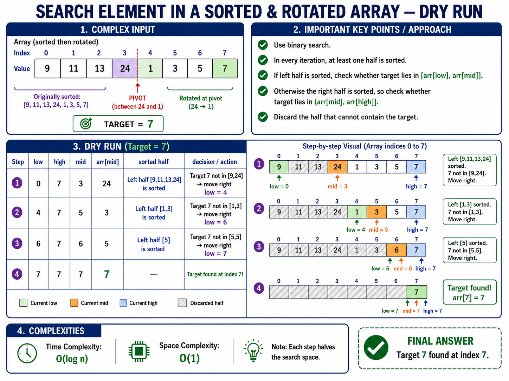
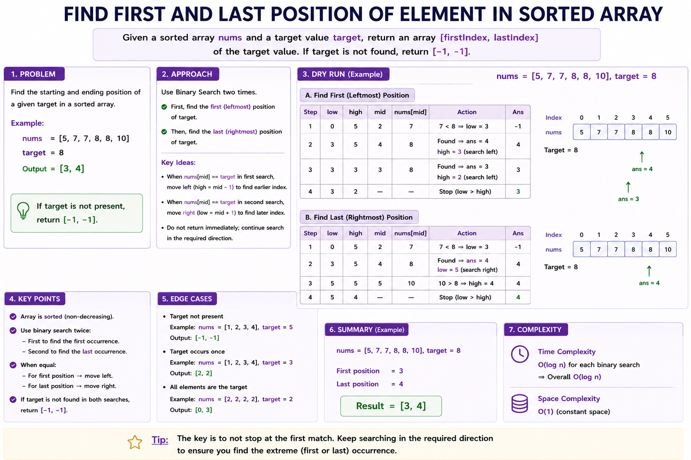
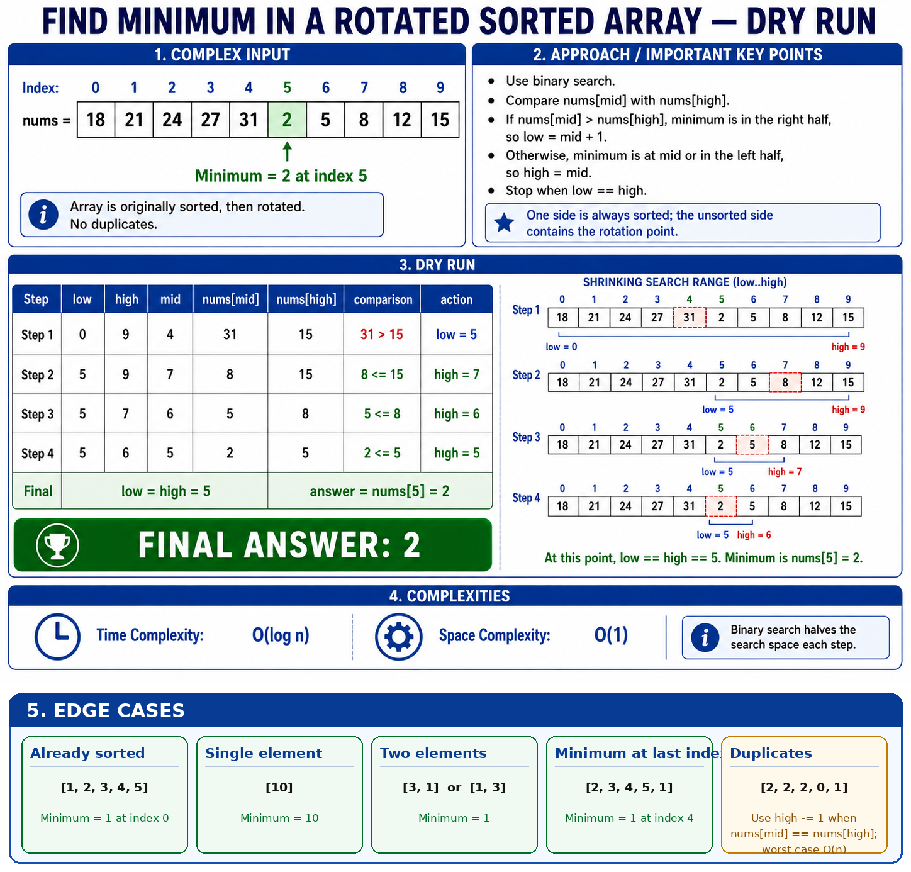
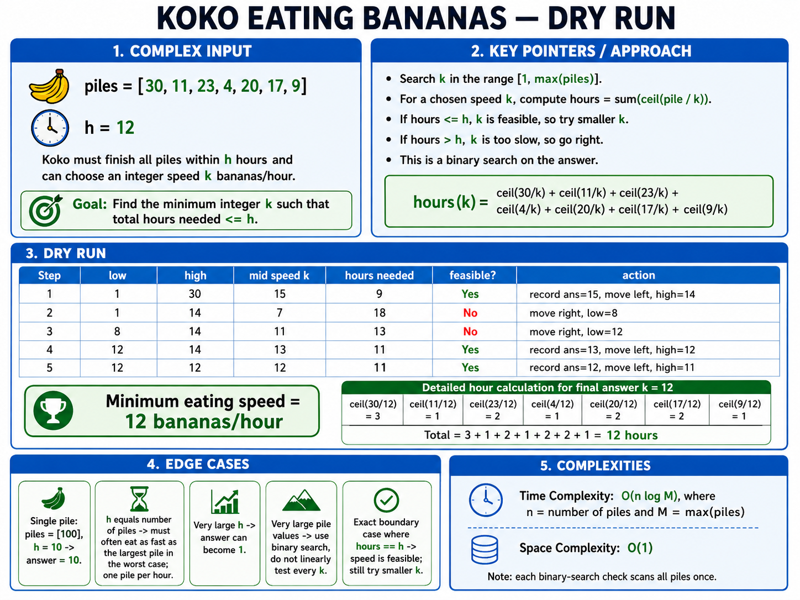
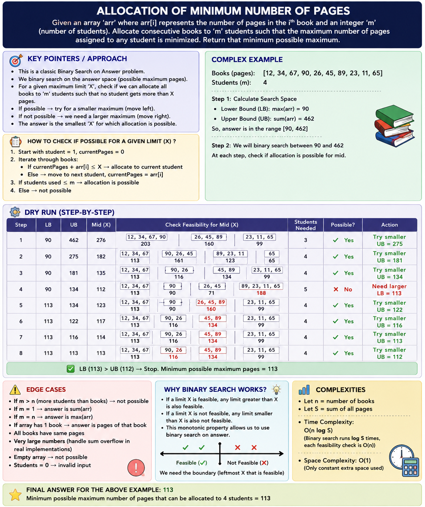
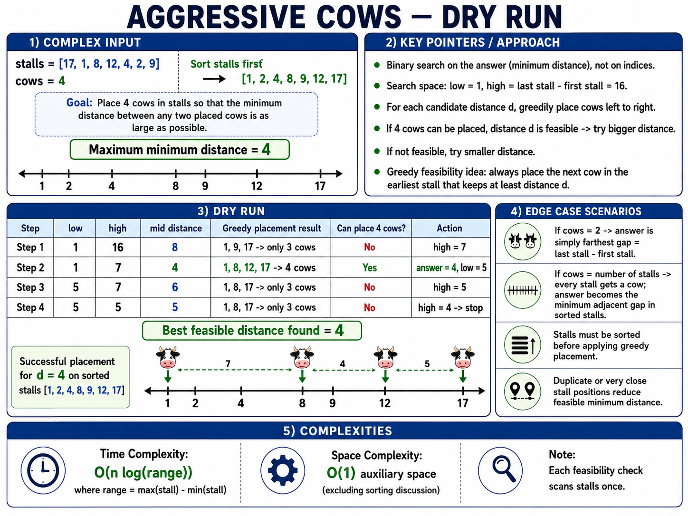
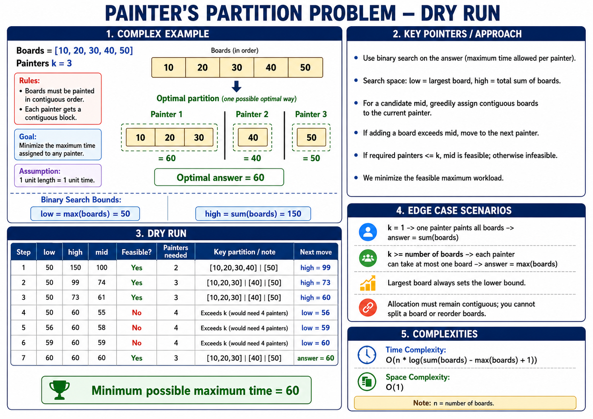

# Binary Search Problems - Striver's Binary Search Vidoes

---

## 1. Lower and Upper Bound

**Core Trick**: Lower bound: arr[mid] >= target, Upper bound: arr[mid] > target

```python
def lower_bound(arr, target):
    low = 0
    ans = len(arr)
    high = len(arr) - 1

    while low <= high:
        mid = (low + high) // 2

        # If mid element is greater than or equal to target
        if arr[mid] >= target:
            ans = mid
            high = mid - 1        # Look left; mid is still a candidate
        else:
            low = mid + 1     # Look right; mid is too small
    return ans

def upper_bound(arr, target):
    low = 0
    ans = len(arr)
    high = len(arr) - 1

    while low < high:
        mid = (low + high) // 2

        # If mid element is strictly greater than target
        if arr[mid] > target:
            ans = mid
            high = mid - 1    # Look left; mid is still a candidate
        else:
            low = mid + 1     # Look right; mid is <= target, so discard it
    return ans

```

---

## 2. Search in an Infinitely Long Sorted Array

It first expands the search range exponentially and then applies binary search.

```python
def find_element_infinite_array(arr, target):
    # Phase 1: Exponential Backoff to find the search window
    low = 0
    high = 1

    # Expand high exponentially until arr[high] is >= target
    while arr[high] < target:
        low = high
        high *= 2  # Double the search space window

    # Phase 2: Standard Binary Search within the discovered window [low, high]
    while low <= high:
        mid = (low + high) // 2

        if arr[mid] == target:
            return mid        # Target found, return its index
        elif arr[mid] > target:
            high = mid - 1    # Look left
        else:
            low = mid + 1     # Look right

    return -1  # Target is not present in the array

```

---

## 3. The N-th Root of an Integer

> **Core Trick**: In binary search on answer, you have to define left and right. It's usually on 1 to m.

```python
def multiply(number, n, target):
    """
    Helper function to calculate number^n safely.
    Returns:
     1 if number^n > target
     0 if number^n == target
    -1 if number^n < target
    """
    ans = 1
    for _ in range(n):
        ans *= number
        if ans > target:
            return 1  # Exceeded target early, prevent unnecessary loops
    if ans == target:
        return 0
    return -1

def nth_root(n, m):
    # Search space for the root is always between 1 and M
    low = 1
    high = m

    while low <= high:
        mid = (low + high) // 2
        mid_power_status = multiply(mid, n, m)

        if mid_power_status == 0:
            return mid       # Exact N-th root found
        elif mid_power_status == 1:
            high = mid - 1   # mid^N is too big, search left
        else:
            low = mid + 1    # mid^N is too small, search right

    return -1  # Return -1 if M is not a perfect N-th power

```

---

## 4. Square Root of an Integer

**Core Trick:** Finding the Square Root of an Integer \(M\) is a specific case of the \(N\)-th root problem where \(N = 2\). If perfect square is not found then we look for floor value.

```python
def floor_sqrt(m):
    # Edge case for 0 and 1
    if m == 0 or m == 1:
        return m

    low = 1
    high = m
    ans = 0  # To track the closest floor square root

    while low <= high:
        mid = (low + high) // 2
        mid_squared = mid * mid

        if mid_squared == m:
            return mid       # Exact perfect square found
        elif mid_squared < m:
            ans = mid        # mid is a potential floor answer, save it
            low = mid + 1    # Try to find a larger value on the right
        else:
            high = mid - 1   # Too big, look left

    return ans

```

---

## 5. Search in a Sorted and Rotated Array



> **Core Trick**: Identify which half is sorted: left/right.

```python
def search_rotated_sorted_array(arr, target):
    low = 0
    high = len(arr) - 1

    while low <= high:
        mid = (low + high) // 2

        # Condition 1: Target found
        if arr[mid] == target:
            return mid

        # Condition 2: Left half is normally sorted
        if arr[low] <= arr[mid]:
            # Check if target falls strictly within this left sorted range
            if arr[low] <= target < arr[mid]:
                high = mid - 1  # Search left
            else:
                low = mid + 1   # Search right

        # Condition 3: Right half is normally sorted
        else:
            # Check if target falls strictly within this right sorted range
            if arr[mid] < target <= arr[high]:
                low = mid + 1   # Search right
            else:
                high = mid - 1  # Search left

    return -1  # Target not found

    # Rotated II - Critical Edge Case: Cannot determine which half is sorted
        if arr[low] == arr[mid] == arr[high]:
            low += 1
            high -= 1
            continue  # Skip to the next iteration with reduced search space
```

---

## 6. Find Peak Element

Question: A peak element in an array is an element that is strictly greater than its **neighbors**.
If **multiple peaks** then return any of them. If peak at **either side** then assume the out-of-bounds neighbors are equal to negative infinity (-∞).

```python
def find_peak_element(arr):
    n = len(arr)

    # Handle single element edge case
    if n == 1:
        return 0

    # Check if the first or last element is a peak
    if arr[0] > arr[1]:
        return 0
    if arr[n - 1] > arr[n - 2]:
        return n - 1

    # Search space excludes the first and last elements since they were already checked
    low = 1
    high = n - 2

    while low <= high:
        mid = (low + high) // 2

        # Condition 1: mid is a peak element
        if arr[mid] > arr[mid - 1] and arr[mid] > arr[mid + 1]:
            return mid

        # Condition 2: We are on an upward slope to the right
        elif arr[mid] < arr[mid + 1]:
            low = mid + 1   # A peak must exist to the right

        # Condition 3: We are on a downward slope, or a local valley
        else:
            high = mid - 1  # A peak must exist to the left

    return -1

```

---

## 7. Find First and Last Position



```python
class Solution:
    def searchRange(self, nums: list[int], target: int) -> list[int]:
        def find_first():
            # Step 1: Initialize the search range and default answer.
            low = 0
            high = len(nums) - 1
            answer = -1

            # Step 2: Run binary search.
            while low <= high:
                mid = (low + high) // 2

                # Step 3: When nums[mid] is target or larger,
                # continue searching toward the left.
                if nums[mid] >= target:
                    # Step 4: Store mid when target is found,
                    # but do not stop because an earlier copy may exist.
                    if nums[mid] == target:
                        answer = mid

                    high = mid - 1

                # Step 5: nums[mid] is smaller than target,
                # so move to the right half.
                else:
                    low = mid + 1

            # Step 6: Return the leftmost target index.
            return answer

        def find_last():
            # Step 1: Initialize the search range and default answer.
            low = 0
            high = len(nums) - 1
            answer = -1

            # Step 2: Run binary search.
            while low <= high:
                mid = (low + high) // 2

                # Step 3: When nums[mid] is target or smaller,
                # continue searching toward the right.
                if nums[mid] <= target:
                    # Step 4: Store mid when target is found,
                    # but continue because a later copy may exist.
                    if nums[mid] == target:
                        answer = mid

                    low = mid + 1

                # Step 5: nums[mid] is larger than target,
                # so move to the left half.
                else:
                    high = mid - 1

            # Step 6: Return the rightmost target index.
            return answer

        # Step 7: Run both searches and return the required range.
        return [find_first(), find_last()]
```

---

## 8. Find Minimum in a Rotated Sorted Array



This version also handles duplicate values. With distinct values, the time complexity is `O(log n)`. With many duplicates, the worst case can become `O(n)`.

```python
class Solution:
    def findMin(self, nums: list[int]) -> int:
        # Step 1: Validate the input.
        if not nums:
            raise ValueError("nums must not be empty")

        # Step 2: Initialize the binary-search range.
        low = 0
        high = len(nums) - 1

        # Step 3: Continue until one minimum candidate remains.
        while low < high:
            # Step 4: Find the middle index.
            mid = (low + high) // 2

            # Step 5: If nums[mid] is smaller than nums[high],
            # the minimum is at mid or somewhere to its left.
            if nums[mid] < nums[high]:
                high = mid

            # Step 6: If nums[mid] is greater than nums[high],
            # the rotation point must be to the right of mid.
            elif nums[mid] > nums[high]:
                low = mid + 1

            # Step 7: Equal values do not reveal the correct half.
            # Remove one duplicate safely from the right.
            else:
                high -= 1

        # Step 8: low points to the minimum element.
        return nums[low]
```

---

## 9. Koko Eating Bananas



> **Correction to the image:** for speed `k = 12`, the total time is **12 hours**, not 11. The final minimum speed of **12 bananas/hour** is correct.

```python
class Solution:
    def minEatingSpeed(self, piles: list[int], h: int) -> int:
        # Step 1: The minimum possible speed is 1.
        low = 1

        # Step 2: The maximum required speed is the largest pile.
        high = max(piles)
        answer = high

        # Step 3: Binary-search for the minimum feasible speed.
        while low <= high:
            # Step 4: Choose a candidate eating speed.
            speed = (low + high) // 2

            # Step 5: Calculate the total hours needed at this speed.
            hours = 0
            for pile in piles:
                hours += (pile + speed - 1) // speed

            # Step 6: If Koko finishes within h hours,
            # save the speed and try a smaller one.
            if hours <= h:
                answer = speed
                high = speed - 1

            # Step 7: Otherwise, the speed is too slow.
            else:
                low = speed + 1

        # Step 8: Return the smallest feasible eating speed.
        return answer
```

---

## 10. Allocation of Minimum Number of Pages



> **Correction to the image:** for books  
> `[12, 34, 67, 90, 26, 45, 89, 23, 11, 65]` and `4` students, the correct minimum possible maximum is **134**, not 113.  
> One optimal allocation is `[12,34,67] | [90,26] | [45,89] | [23,11,65]`.

```python
def allocate_minimum_pages(books, students):
    # Step 1: Validate the input.
    if not books or students <= 0 or students > len(books):
        return -1

    def students_needed(page_limit):
        # Step 2: Start by assigning books to the first student.
        used = 1
        current_pages = 0

        # Step 3: Allocate books in their original contiguous order.
        for pages in books:
            # Step 4: Keep the book with the current student
            # when it does not exceed the page limit.
            if current_pages + pages <= page_limit:
                current_pages += pages

            # Step 5: Otherwise, start allocation for a new student.
            else:
                used += 1
                current_pages = pages

        # Step 6: Return how many students this limit requires.
        return used

    # Step 7: The answer cannot be smaller than the largest book.
    low = max(books)

    # Step 8: One student reading every book gives the upper bound.
    high = sum(books)
    answer = high

    # Step 9: Binary-search for the minimum feasible page limit.
    while low <= high:
        page_limit = (low + high) // 2

        # Step 10: If the allocation uses at most the available students,
        # save the limit and try a smaller maximum.
        if students_needed(page_limit) <= students:
            answer = page_limit
            high = page_limit - 1

        # Step 11: Otherwise, increase the allowed page limit.
        else:
            low = page_limit + 1

    # Step 12: Return the minimum possible maximum pages.
    return answer
```

---

## 11. Aggressive Cows



```python
def aggressive_cows(stalls, cows):
    # Step 1: Validate the input.
    if not stalls or cows <= 0 or cows > len(stalls):
        return -1

    # Step 2: With one cow, no distance between cows is required.
    if cows == 1:
        return 0

    # Step 3: Sort stall positions before greedy placement.
    stalls.sort()

    def can_place(minimum_distance):
        # Step 4: Place the first cow in the first stall.
        placed = 1
        last_position = stalls[0]

        # Step 5: Greedily place every next cow at the earliest
        # stall that maintains the required minimum distance.
        for position in stalls[1:]:
            if position - last_position >= minimum_distance:
                placed += 1
                last_position = position

                # Step 6: The candidate distance is feasible.
                if placed == cows:
                    return True

        # Step 7: Not enough cows could be placed.
        return False

    # Step 8: Search possible minimum distances.
    low = 1
    high = stalls[-1] - stalls[0]
    answer = 0

    # Step 9: Binary-search for the largest feasible distance.
    while low <= high:
        distance = (low + high) // 2

        # Step 10: If feasible, save it and try a larger distance.
        if can_place(distance):
            answer = distance
            low = distance + 1

        # Step 11: Otherwise, try a smaller distance.
        else:
            high = distance - 1

    # Step 12: Return the maximum possible minimum distance.
    return answer
```

---

## 12. Painter's Partition Problem



```python
def painters_partition(boards, painters):
    # Step 1: Validate the input.
    if not boards or painters <= 0:
        return -1

    def painters_needed(time_limit):
        # Step 2: Start assigning boards to the first painter.
        used = 1
        current_work = 0

        # Step 3: Assign boards in contiguous order.
        for board in boards:
            # Step 4: Keep the board with the current painter
            # if the total work stays within time_limit.
            if current_work + board <= time_limit:
                current_work += board

            # Step 5: Otherwise, assign this board to a new painter.
            else:
                used += 1
                current_work = board

        # Step 6: Return the painters required for this limit.
        return used

    # Step 7: No valid answer can be below the largest board.
    low = max(boards)

    # Step 8: One painter doing all work gives the upper bound.
    high = sum(boards)
    answer = high

    # Step 9: Binary-search for the minimum feasible maximum workload.
    while low <= high:
        time_limit = (low + high) // 2

        # Step 10: If the work fits within the available painters,
        # save the limit and try a smaller one.
        if painters_needed(time_limit) <= painters:
            answer = time_limit
            high = time_limit - 1

        # Step 11: Otherwise, increase the time limit.
        else:
            low = time_limit + 1

    # Step 12: Return the minimum possible maximum painting time.
    return answer
```
