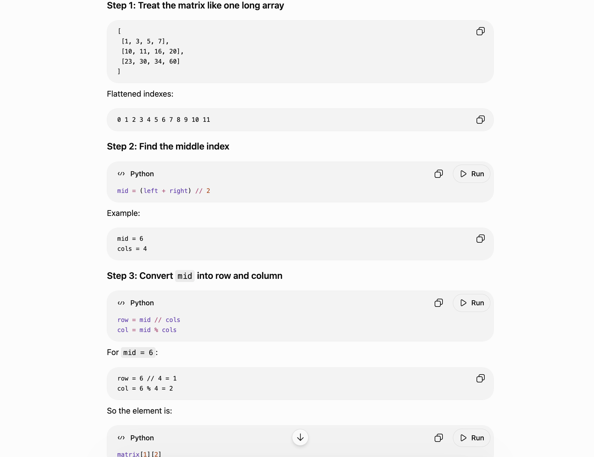

The rule is simply:
If current > target → move left by one column.
If current < target → move down by one row.
If current == target → found it.

Core Trick: Start at TOP-RIGHT

class Solution: def searchMatrix(self, matrix, target): rows = len(matrix) cols = len(matrix[0]) row = 0 col = cols - 1 while row < rows and col >= 0: if matrix[row][col] == target: return True elif matrix[row][col] > target: col -= 1 # Move left else: row += 1 # Move down return False
