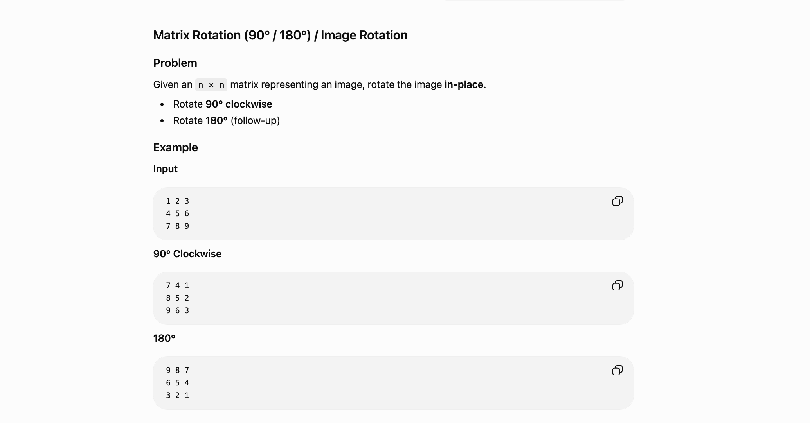

Python Code
class Solution:
    def rotate180(self, matrix):
        n = len(matrix)

        for i in range(n):
            for j in range(n):

                new_i = n - 1 - i
                new_j = n - 1 - j

                if (i < new_i) or (i == new_i and j < new_j):
                    matrix[i][j], matrix[new_i][new_j] = matrix[new_i][new_j], matrix[i][j]

        return matrix
