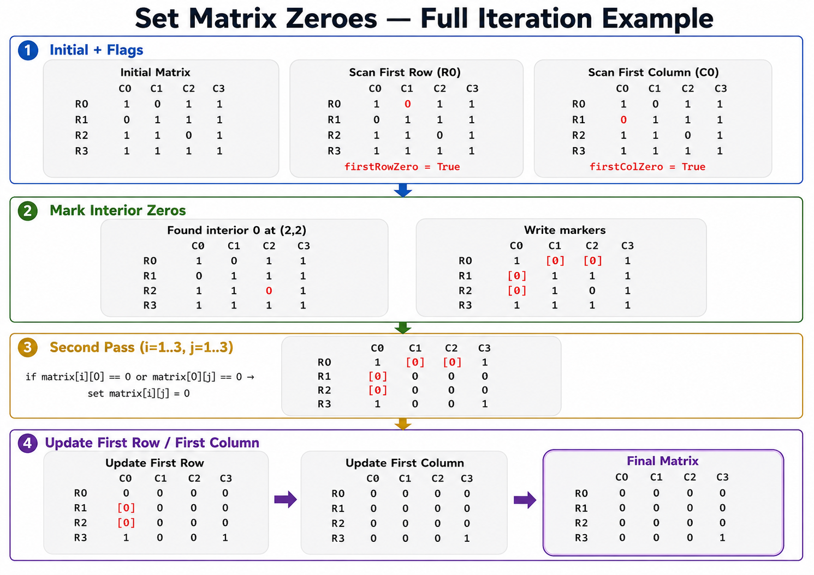

Set Matrix Zeroes

LeetCode: 73Code Trick: Use the first row and first column as markers.

from typing import List

class Solution:
def setZeroes(self, matrix: List[List[int]]) -> None:
rows = len(matrix)
cols = len(matrix[0])

        firstRowZero = any(matrix[0][j] == 0 for j in range(cols))
        firstColZero = any(matrix[i][0] == 0 for i in range(rows))

        # Mark rows and columns using the first row and first column
        for i in range(1, rows):
            for j in range(1, cols):
                if matrix[i][j] == 0:
                    matrix[i][0] = 0
                    matrix[0][j] = 0

        # Apply markers to the inner matrix
        for i in range(1, rows):
            for j in range(1, cols):
                if matrix[i][0] == 0 or matrix[0][j] == 0:
                    matrix[i][j] = 0

        # Update the first row
        if firstRowZero:
            for j in range(cols):
                matrix[0][j] = 0

        # Update the first column
        if firstColZero:
            for i in range(rows):
                matrix[i][0] = 0

Iteration Example

Initial Matrix

      C0 C1 C2 C3

R0 1 0 1 1
R1 0 1 1 1
R2 1 1 0 1
R3 1 1 1 1

Scan First Row and First Column

firstRowZero = True
firstColZero = True

Mark Interior Zero at (2,2)

      C0 C1 C2 C3

R0 1 [0][0] 1
R1 [0] 1 1 1
R2 [0] 1 0 1
R3 1 1 1 1

Second Pass

      C0 C1 C2 C3

R0 1 [0][0] 1
R1 [0] 0 0 0
R2 [0] 0 0 0
R3 1 0 0 1

Update First Row

      C0 C1 C2 C3

R0 0 0 0 0
R1 [0] 0 0 0
R2 [0] 0 0 0
R3 1 0 0 1

Update First Column

      C0 C1 C2 C3

R0 0 0 0 0
R1 0 0 0 0
R2 0 0 0 0
R3 0 0 0 1

Complexity

Time: O(rows × cols)

Extra space: O(1)
